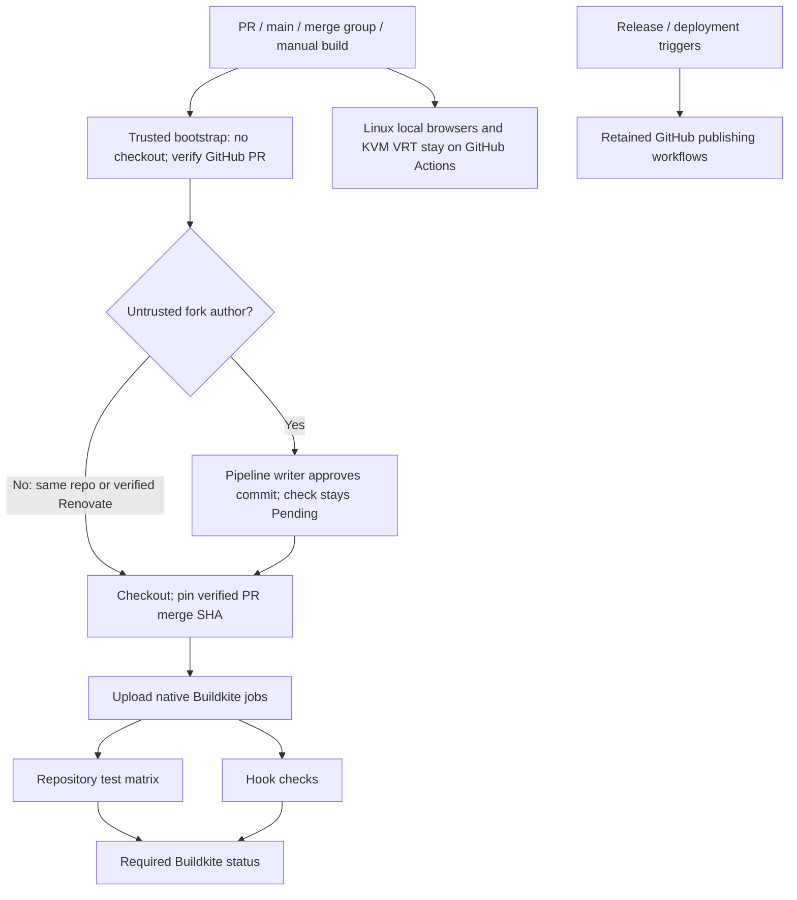
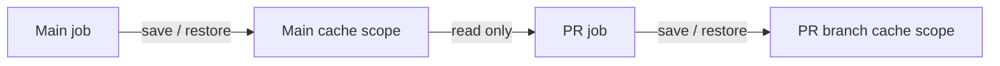
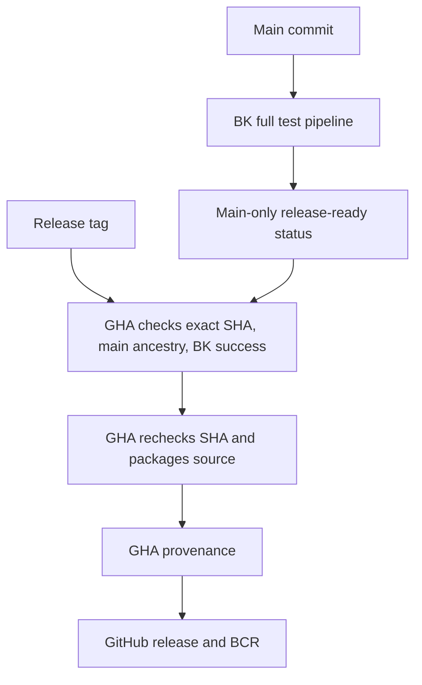

# Buildkite CI

Bazel 9.2.0/8.6.0 module and BCR consumers on Linux/macOS; host Chromium/Electron; macOS VRT build smoke; commit hooks. Test reports upload on failure too.

Each Bazel job restores its isolated repository/action cache, runs checks, then saves after success. Hosted queues: `oss` (Linux AMD64), `oss_darwin_arm64` (macOS ARM64). Queue `default` is not used. Tools are checksum-pinned; pnpm follows `packageManager` or npm uses `npm ci`.

## Cache isolation

Bazel jobs use the `oss-ci-v2` registry with server-enforced pipeline/branch scopes.
PRs restore their own branch or main; writes stay in their verified branch.
Main restores only main. GitHub **Prefix third-party fork branch names** must stay
on, so a fork branch named `main` cannot write the real main scope. Cache keys and
PR-controlled YAML are not access controls.

Shared hosted cache volumes are removed. Only repository/action caches persist;
Bazelisk and downloaded tools start fresh per job. The new registry starts empty,
so existing untrusted cache entries are never restored. Initial builds run cold.

Create the registry once in the OSS cluster with `.buildkite/cache-policy.json`.
Do not replace it with the unrestricted default registry. Policy scopes come from
Buildkite's authenticated job claims, not environment variables supplied by jobs.

Paste `bootstrap.yml` into pipeline settings; never load approval policy from a PR checkout. Forks require writer approval before checkout or hooks. Only GitHub-verified `renovate[bot]` (ID `29139614`, type `Bot`) bypasses. Each new commit needs approval; API errors and stale PR heads fail closed. Enable third-party forks and publish blocked builds as Pending. Keep workflow tokens and pipeline/cluster secrets disabled.

Build main pushes, PR updates/reopens/base changes, and merge groups; disable tags. Preserve PR exclusions shown in `pipeline.yml`. Manual builds support former workflow-dispatch checks. Retain required GHA ARM64 checks. Replace migrated required GHA checks with `buildkite/rules-web-e2e` from the Buildkite app only after native checks pass.

Remaining GHA: Release Please and bazel-contrib release/BCR publishing retain their GitHub provenance identities.

Linux ARM64 jobs stay on GHA per requested runner policy. No new queue provisioned.

Local Linux browsers (AMD64 and ARM64) stay on GHA: hosted OSS agents reject `pivot_root`. No host-execution fallback added.

Production KVM VRT stays on GHA: hosted OSS agents cannot open `/dev/vhost-vsock`. Original required VRT check stays enforced.

## Releases

GHA waits for `release-ready/rules-web-e2e` on the exact release tag commit. Only non-PR main builds publish that status, after the full BK pipeline finishes. Failed builds stop publication; missing/pending checks time out after 90 minutes. No new secrets or BK token permissions.

The reusable GHA release workflow checks that its checkout still matches the verified SHA, packages the source archive, attests provenance, and publishes BCR. Its duplicate Bazel test run and Bazel caches are disabled. Existing runner exceptions remain on GHA.

