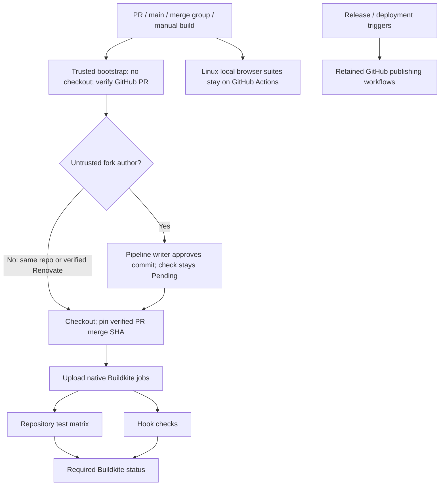

# Buildkite CI

Bazel 9.2.0/8.6.0 module and BCR consumers on Linux/macOS; host Chromium/Electron; production KVM VRT; macOS VRT build smoke; commit hooks. Test reports upload on failure too. Linux VRT requires `/dev/kvm` and `/dev/vhost-vsock`; unsupported runners fail rather than skip the suite.

Each Bazel job restores its suite/version/platform cache, runs checks, then saves after success. Hosted queues: `oss` (Linux AMD64), `oss_darwin_arm64` (macOS ARM64). Queue `default` is not used. Tools are checksum-pinned; pnpm follows `packageManager` or npm uses `npm ci`.

Paste `bootstrap.yml` into pipeline settings; never load approval policy from a PR checkout. Forks require writer approval before checkout or hooks. Only GitHub-verified `renovate[bot]` (ID `29139614`, type `Bot`) bypasses. Each new commit needs approval; API errors and stale PR heads fail closed. Enable third-party forks and publish blocked builds as Pending. Keep workflow tokens and pipeline/cluster secrets disabled.

Build main pushes, PR updates/reopens/base changes, and merge groups; disable tags. Preserve PR exclusions shown in `pipeline.yml`. Manual builds support former workflow-dispatch checks. Retain required GHA ARM64 checks. Replace migrated required GHA checks with `buildkite/rules-web-e2e` from the Buildkite app only after native checks pass.

Remaining GHA: Release Please and bazel-contrib release/BCR publishing retain their GitHub provenance identities.

Linux ARM64 jobs stay on GHA per requested runner policy. No new queue provisioned.

Local Linux browsers (AMD64 and ARM64) stay on GHA: hosted OSS agents reject `pivot_root`. No host-execution fallback added.
