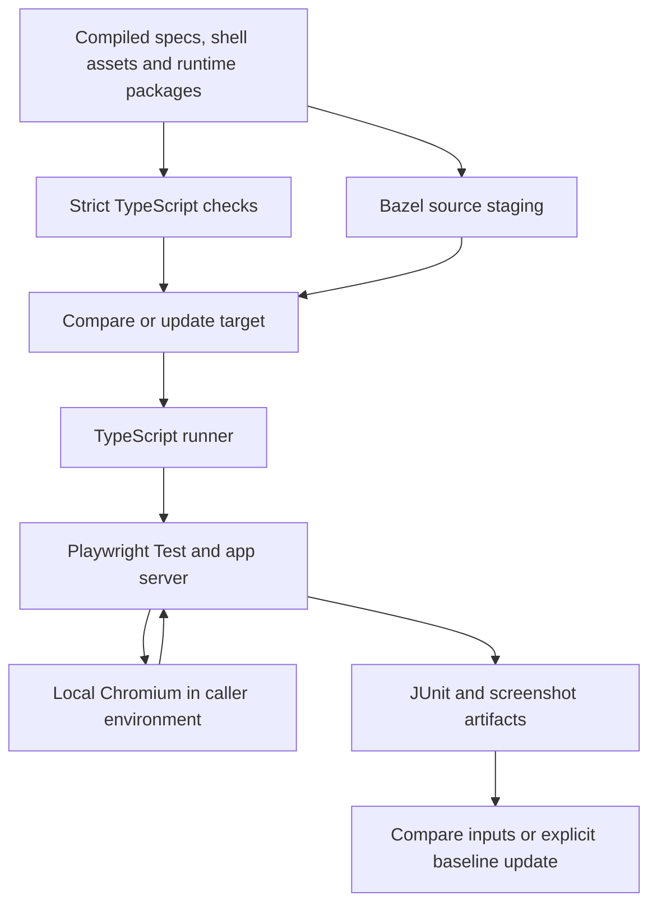

# Architecture

Keep Bazel integration small and test-runner configuration consumer-owned.
The rules declare inputs and execution constraints; TypeScript helpers handle
processes, browser connections, and artifacts. Application conventions stay in
the consuming repository.

## Ownership

| Layer              | Owns                                                                                                    |
| ------------------ | ------------------------------------------------------------------------------------------------------- |
| Consumer           | Specs, React providers, CSS, fonts, fixtures, aliases, authentication, and server configuration.        |
| Bazel macro        | Source staging, runner labels, runfiles locations, environment, timeouts, and target tags.              |
| TypeScript runtime | Local browser configuration, isolated capture directories, and baseline synchronization. |
| Playwright Test    | Test execution, assertions, browser automation, and screenshot comparison.                              |
| Consumer CI        | Execution image, browser provisioning, network policy, scheduling, artifacts, and baseline review.                                            |

No framework theme, deployment platform, secret provider, telemetry service,
or CI vendor is required by the test runtime. Consumers explicitly declare
additional environment variables and dependencies.

## Execution path

The consumer build owns source compilation and npm dependencies. Every test
launches a provisioned local browser through Playwright. For VRT, the caller
runs Bazel, the server, and browser inside the same pinned Linux image.
The runner validates declared Playwright package versions and manages child
processes, timeouts, staged inputs, and outputs.

See [execution environments](vrt-environment.md) for rendering stability and
[consumer setup](host-browsers.md) for image ownership and migration.

## TypeScript and Bazel inputs

All maintained runtime code and executable configuration are TypeScript. Bazel
compiles the runtime to JavaScript and exposes generated declarations through
`@rules-web-e2e/vrt`. Consumer build targets must typecheck and emit specs before execution;
shell builds must depend on typechecks as well.

The example's `:typecheck` filegroup requests `transitive_typecheck` outputs from
`ts_project` and is an input to the shell build. This makes compiler validation a
required build action even when `no_emit` produces no default output files.

Stage sources once through `js_library`, then pass them to the browser runner.
This avoids conflicting copy actions when typechecking and browser execution
share inputs but have different execution tags. Declare `package.json` alongside
compiled ESM modules when its `type` field controls ESM loading. Declare imported
assets, generated CSS, and cross-package sources as well as npm dependencies.

Resolve executable/config labels through Bazel runfiles, including when the
rules are an external module. Never derive consumer paths from the rules'
checkout location. Cache directories and generated captures belong in temporary
storage, separate from committed baselines.

## Test layers

| Public API               | Boundary                                              |
| ------------------------ | ----------------------------------------------------- |
| `web_e2e_test`           | Native specs against a managed server or existing URL |
| `component_browser_test` | Native mounts through a consumer gallery              |
| `visual_test`            | Native screenshot specs and baseline updates          |
| `component_visual_test`  | Generated visual captures and baseline updates        |

See the [API reference](api.md) for attributes and configuration helpers.

Server adapters own readiness and teardown; a config-only target delegates
its native `webServer` lifecycle to Playwright. Both paths share the same
runfiles staging and fixture isolation. Deployed
mode requires an explicit endpoint and consumer-provided auth setup;
it must not silently fall back to a local service or ambient credentials.

Native Playwright 1.63 component specs mount named browser fixtures. The consumer
owns the gallery, framework rendering, and provider setup. The same gallery
supports interaction tests and independent screenshot targets. See
[component browser tests](component-browser.md).

## Implementation map

- [Public macro](../vrt/defs.bzl): Bazel targets and execution contract.
- [Runner](../runtime/runner.ts): runfiles, child process, and outputs.
- [Config helper](../runtime/config.ts): typed Playwright Test and browser defaults.
- [Runtime build](../runtime/BUILD.bazel): compilation and declaration packaging.

Playwright Test owns fixtures, browser contexts, assertions, and traces. The
runtime owns managed-server readiness and cleanup; remote endpoints remain
caller-owned. Both supply `VRT_APP_URL` to the config helper. Network restrictions belong to the caller environment. [Remote E2E](e2e.md) deliberately depends
on external application state and host networking.

## Built artifact seam

Test call sites accept compiled specs and either a compiled server adapter, a
built shell, or an existing endpoint. `browser_shell` describes the HTML entry
point within a built asset directory. The static server never transforms source.
A reusable `playwright_runtime` groups version-matched client packages;
`matching` separately supplies VRT comparison policy. Application bundlers,
framework versions, and generated styles stay in the consumer build graph.
