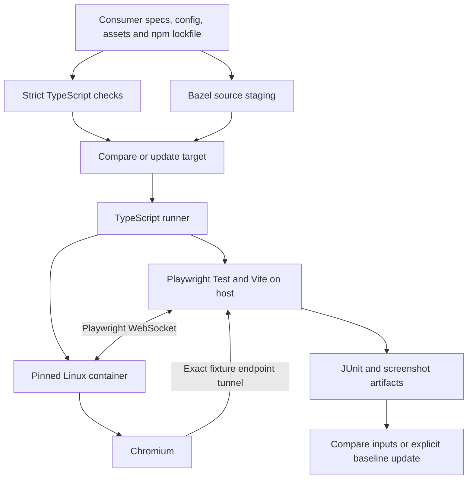

# Architecture

Keep Bazel integration small and test-runner configuration consumer-owned.
The rules declare inputs and execution constraints; TypeScript helpers handle
processes, browser connections, and artifacts. Application conventions stay in
the consuming repository.

## Ownership

| Layer              | Owns                                                                                                    |
| ------------------ | ------------------------------------------------------------------------------------------------------- |
| Consumer           | Specs, React providers, CSS, fonts, fixtures, aliases, authentication, and server configuration.        |
| Bazel macro        | Source staging, runner labels, runfiles locations, environment, timeouts, and target tags.              |
| TypeScript runtime | Container lifecycle, Playwright connection, isolated capture directories, and baseline synchronization. |
| Playwright Test    | Test execution, assertions, browser automation, and screenshot comparison.                              |
| Consumer CI        | Scheduling, artifact upload, and review of baseline changes.                                            |

No framework theme, deployment platform, secret provider, telemetry service,
or CI vendor is required by the test runtime. Consumers explicitly declare
additional environment variables and dependencies.

## Current component VRT path

The host owns the source tree and npm dependency graph. The container supplies
the browser and OS rendering environment. The runner verifies the declared
`playwright-core` version and copies that package into the container before
starting the server. Playwright forwards browser requests to the host Vite
server; Docker does not need a source-tree bind mount or an npm install.

Each invocation uses Testcontainers to create a browser, control relay, and
internal network, and removes them on completion or handled termination. Playwright Test execution and Bazel have separate
timeouts. The supported contract currently requires a local Docker daemon;
remote daemons and shared-container reuse need separate validation.

The [Testcontainers design](testcontainers-vrt.md) explains why a pinned browser
environment improves VRT stability and describes the implemented input,
environment, and network isolation boundaries.

## TypeScript and Bazel inputs

All maintained runtime code and executable configuration are TypeScript. Bazel
compiles the runtime to JavaScript and exposes generated declarations through
`@rules-web-e2e/vrt`. Consumer configs and specs also need strict typechecks;
transpiling browser code with Vite does not establish type safety.

The example's `:typecheck` filegroup requests `transitive_typecheck` outputs from
`ts_project` and is an input to the VRT target. This makes compiler validation a
required build action even when `no_emit` produces no default output files.

Stage sources once through `js_library`, then pass them to the browser runner.
This avoids conflicting copy actions when typechecking and browser execution
share inputs but have different execution tags. Declare `package.json` alongside
TypeScript configs when its `type` field controls ESM loading. Declare imported
assets, generated CSS, and cross-package sources as well as npm dependencies.

Resolve executable/config labels through Bazel runfiles, including when the
rules are an external module. Never derive consumer paths from the rules'
checkout location. Cache directories and generated captures belong in temporary
storage, separate from committed baselines.

## Test layers

| Proposed API                   | Intended boundary                                                                              |
| ------------------------------ | ---------------------------------------------------------------------------------------------- |
| `playwright_test`              | Thin wrapper around consumer Playwright specs/config, declared browser artifacts, and reports. |
| `web_e2e_test` (implemented)   | Adds either managed local-server startup or an explicit deployed URL.                          |
| Native `mount()` (implemented) | Uses `component_browser_test` and a consumer gallery for real-browser component assertions.    |
| `web_visual_test`              | Adds the visual capture/update contract to page tests.                                         |

Managed-server mode must own startup, readiness, ports, and teardown. Deployed
mode must explicitly opt into network access and consumer-provided auth setup;
it must not silently fall back to a local service or ambient credentials.

Native Playwright 1.63 component specs mount named browser stories. The consumer
owns the gallery, framework rendering, and provider setup. The same gallery
supports interaction tests and independent screenshot targets. See
[component browser tests](component-browser.md).

## Implementation map

- [Public macro](../vrt/defs.bzl): Bazel targets and execution contract.
- [Runner](../runtime/runner.ts): runfiles, Docker, child process, and outputs.
- [Config helper](../runtime/config.ts): typed Playwright Test and browser defaults.
- [Runtime build](../runtime/BUILD.bazel): compilation and declaration packaging.

Playwright Test owns fixtures, browser contexts, assertions, and traces. The
runtime owns managed-server readiness and cleanup; remote endpoints remain
caller-owned. Both supply `VRT_APP_URL` to the config helper and retain exact
host/port browser tunnel restrictions. [Remote E2E](e2e.md) deliberately depends
on external application state while retaining the pinned browser environment.
