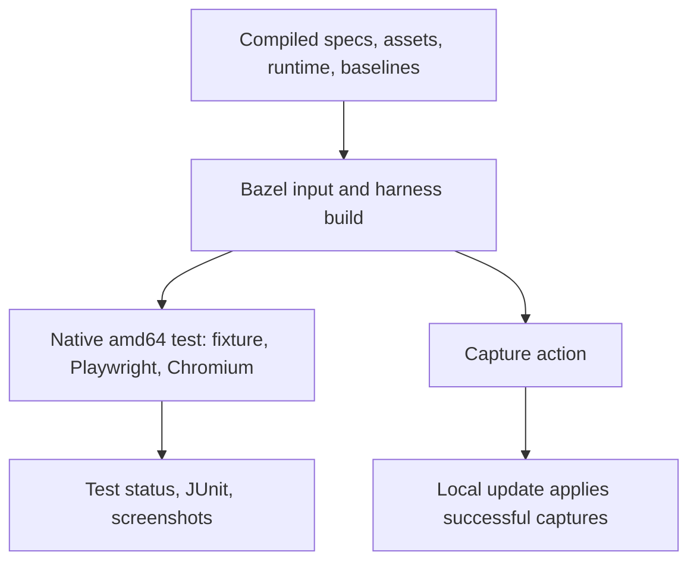

# Architecture

Bazel prepares suites. Bazel owns test execution contract.
Consumer owns test-runner configuration. TypeScript helpers handle processes,
browser connections, and artifacts. App conventions stay in consumer repo.

## Ownership

| Layer | Owns |
| ------------------ | ------------------------------------------------------------------------------------------------------- |
| Consumer | Specs, React providers, CSS, fonts, fixtures, aliases, authentication, and server configuration. |
| Bazel rules | Built harnesses and helper layouts, runner labels, runfiles, execution constraints, and test lifecycle. |
| TypeScript runtime | VRT action bootstrap, host browser configuration, isolated capture directories, and baseline synchronization. |
| Playwright Test | Test execution, assertions, browser automation, and screenshot comparison. |
| Consumer CI | Scheduling, artifact upload, and review of baseline changes. |

No framework theme, deployment platform, secret provider, telemetry service,
or CI vendor required by test runtime. Consumers explicitly declare
additional environment variables and dependencies.

## Execution path

```mermaid
flowchart TD
  Inputs[Compiled specs, assets, runtime, baselines] --> Build[Bazel input and harness build]
  Build --> Test[Native amd64 test: fixture, Playwright, Chromium]
  Test --> Reports[Test status, JUnit, screenshots]
  Build --> Capture[Capture action]
  Capture --> Update[Local update applies successful captures]
```

VRT runs in actiond Linux amd64 worker using declared runtime files as its
root filesystem. Entire suite has loopback-only networking. No browser
server tunnel or Docker daemon participates in execution. On amd64, Bazel runs
comparison as native test and downloads failure reports
and screenshots through its test output mechanism. Local update command
explicitly applies successful capture-action outputs. ARM64 comparison retains
build-action/result-wrapper path until its native launcher tools available.
See [worker setup and isolation](actiond.md).

Host E2E/component targets run their server and browser on host with
provisioned Chromium. Shared runner checks Playwright package versions,
resolves declared runfiles, and manages child processes and artifacts.

## TypeScript and Bazel inputs

All maintained runtime code and executable configuration TypeScript. Bazel
compiles runtime to JavaScript and exposes generated declarations through
`@rules-web-e2e/vrt`. Consumer build targets must typecheck and emit specs before execution;
shell builds must depend on typechecks as well.

Example's `:typecheck` filegroup requests `transitive_typecheck` outputs from
`ts_project` and input to shell build. This makes compiler validation
required build action even when `no_emit` produces no default output files.

Stage sources once through `js_library`, then pass them to browser runner.
This avoids conflicting copy actions when typechecking and browser execution
share inputs but have different execution tags. Declare `package.json` alongside
compiled ESM modules when its `type` field controls ESM loading. Declare imported
assets, generated CSS, and cross-package sources as well as npm dependencies.

Resolve executable/config labels through Bazel runfiles, including when
rules external module. Never derive consumer paths from rules'
checkout location. Cache directories and generated captures belong in temporary
storage, separate from committed baselines.

## Test layers

| Public API | Boundary |
| ------------------------ | ----------------------------------------------------- |
| `web_e2e_test` | Native specs against managed server or existing URL |
| `component_browser_test` | Native mounts through consumer gallery |
| `visual_test` | Native screenshot specs and baseline updates |
| `component_visual_test` | Generated visual captures and baseline updates |

See [API reference](api.md) for attributes and configuration helpers.

Server adapters own readiness and teardown; config-only target delegates
its native `webServer` lifecycle to Playwright. Both paths share same
runfiles staging and fixture isolation. VRT isolates entire suite in Linux.
Deployed host E2E requires consumer-provided endpoints and auth setup;
it must not silently fall back to local service or ambient credentials.

Native Playwright 1.63 component specs mount named browser fixtures. Consumer
owns gallery, framework rendering, and provider setup. Same gallery
supports interaction tests and independent screenshot targets. See
[component browser tests](component-browser.md).

## Implementation map

- [Public macro](../vrt/defs.bzl): Bazel targets and execution contract.
- [Runner](../runtime/runner.ts): runfiles, child processes, and outputs.
- [Config helper](../runtime/config.ts): typed Playwright Test and browser defaults.
- [Runtime build](../runtime/BUILD.bazel): compilation and declaration packaging.

Playwright Test owns fixtures, browser contexts, assertions, and traces.
runtime owns managed-server readiness and cleanup; remote endpoints remain
caller-owned. Both supply `VRT_APP_URL` to config helper. VRT permits only action-local loopback networking. [Remote E2E](e2e.md) deliberately depends
on external application state and host networking.

## Built artifact seam

Test call sites accept compiled specs and either compiled server adapter,
built shell, or existing endpoint. `browser_shell` describes HTML entry
point within built asset directory. Static server never transforms source.
Reusable `playwright_runtime` groups version-matched client packages;
`matching` separately supplies VRT comparison policy. Application bundlers,
framework versions, and generated styles stay in consumer build graph.

## Declared suite harness

Each input target builds private `<target>_inputs.suite/` directory containing
its compiled Playwright config, helper modules, package metadata, and (for
component visual suite) capture spec. These immutable Bazel outputs carried
in runfiles. Test startup does not copy harness code or create `node_modules`
link. Runner resolves and validates caller's Playwright package, then
passes its package location to harness so specs and configuration share
same test instance. Dynamic URLs, gallery discovery, caches, and reports remain
execution-time state.
