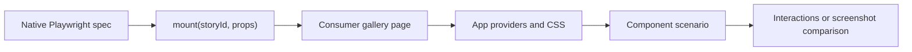

# Native component browser tests

Playwright **1.63.0** supplies `mount()` in `@playwright/test`. Use the existing
`web_e2e_test` rule and pinned Testcontainers browser. No experimental React test
package or second bundler is needed. See the [Playwright component guide](https://playwright.dev/docs/test-components).



A consumer-owned gallery exposes `window.mount({story, props})` and
`window.unmount()`, rendering into `#root`. Its registry imports declared story
modules. Reuse the React root for prop updates, reject unknown stories and render
errors, and release the root on unmount. Put providers and callbacks in browser
stories; pass serializable props from specs. The runtime remains framework-free.

The [typed React gallery](../examples/react/gallery.tsx) uses the existing UI shell
and Vite adapter. The [component config](../examples/react/component.config.ts)
composes `e2eConfig`, selects `*.browser.spec.ts`, and sets `use.baseURL` to the
gallery URL on the allowed server origin. It blocks service workers; omit that
setting if a story intentionally uses a service-worker mock. Declare stories,
HTML, config, CSS, generated assets, and dependencies in the target's inputs and
strict typecheck.

```ts
import {expect, test} from '@playwright/test'
import type {Counter} from './counter.story'

test('retains state across prop updates', async ({mount}) => {
  const component = await mount<typeof Counter>('Counter/Default', {
    title: 'First',
  })
  await component.getByRole('button', {name: 'Increment'}).click()
  await component.update({title: 'Updated'})
  await expect(component.getByRole('status', {name: 'Count'})).toHaveText('1')
  await component.unmount()
  await expect(component).toBeEmpty()
})
```

VRT uses the **same gallery and native mount fixture** with `visualConfig` and
`component_visual_test`. Screenshot the returned locator using
`expect(component).toHaveScreenshot(...)`. Give independent visual targets
separate baseline directories so one update cannot replace another's PNGs.

```sh
cd examples/react
bazel test //:component_test //:component_visual_test
bazel run //:component_visual_test.update
```

## Migrating experimental component tests

| Previous convention                              | Playwright 1.63 convention                            |
| ------------------------------------------------ | ----------------------------------------------------- |
| Imports from `@playwright/experimental-ct-react` | `@playwright/test`                                    |
| `mount(<Widget ... />)` in Node                  | Browser story plus `mount('Widget/Scenario', props)`  |
| `component.update(<Widget ... />)`               | `component.update(props)`                             |
| Node callbacks and JSX children                  | Browser-owned scenario; assert DOM or network effects |
| Mount hooks and provider wrappers                | Consumer gallery shell and story setup                |
| `ctViteConfig` and CT-managed server             | Existing server adapter and its normal bundler config |
| `*.browser.spec.tsx` with inline JSX             | `*.browser.spec.ts` and typed `*.story.tsx`           |

Existing JSX-based specs require migration; this is not a compatibility shim.
Large repositories can adapt an existing preview registry to the gallery
contract and retain their aliases, generated styles, auth fixtures, and CI
reporters internally. Keep both behavioral specs and VRT targets throughout the
migration. Playwright/browser pins must match at 1.63.0.
