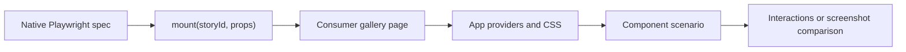

# Native component browser tests

Playwright **1.63.0** supplies `mount()` in `@playwright/test`. Use
`component_browser_test` from `@rules_web_e2e//component:defs.bzl` with the pinned
Testcontainers browser. No experimental React test
package or second bundler is needed. See the [Playwright component guide](https://playwright.dev/docs/test-components).



A consumer-owned gallery exposes `window.mount({story, props})` and
`window.unmount()`, rendering into `#root`. Its registry imports declared visual
modules. `.visual.tsx` declares `ComponentVisualModule` scenarios; the `story` field is part of
Playwright's native mount protocol. No Storybook integration is involved. Reuse the React root for prop updates, reject unknown stories and render
errors, and release the root on unmount. Put providers and callbacks in browser
stories; pass serializable props from specs. The runtime remains framework-free.

The [typed React gallery](../examples/react/gallery.tsx) uses a consumer-owned
UI shell. Build its HTML, JavaScript, CSS, and assets before testing and wrap
the output directory with `browser_shell`. The runner serves it without a
bundler and selects the compiled `*.browser.spec.js` files from `tests`.
Service workers are blocked by default; an optional compiled Playwright config
can set `use.serviceWorkers` to `"allow"` when a fixture needs one.

```ts
import {expect, test} from '@playwright/test'
import type {Counter} from './counter.visual'

test('retains state across prop updates', async ({mount}) => {
  const component = await mount<typeof Counter>('Counter/Default', {
    title: 'First',
  })
  await component.getByRole('button', {name: 'Increment'}).click()
  await component.update({title: 'Updated'})
  await expect(component.getByRole('status', {name: 'Count'})).toHaveText('1')
  await component.unmount()
  await expect(component).toBeEmpty()
})
```

VRT consumes the **same visual modules and gallery** through `component_visual_test`. The runtime generates screenshot tests from each enabled
visual's `vrt` options and capture hooks. There are no separate consumer screenshot
specs. Independent VRT targets must own separate baseline directories.

```sh
cd examples/react
bazel test //:component_test //:component_visual_test
bazel run //:component_visual_test.update
```

## Migrating experimental component tests

| Previous convention                              | Playwright 1.63 convention                             |
| ------------------------------------------------ | ------------------------------------------------------ |
| Imports from `@playwright/experimental-ct-react` | `@playwright/test`                                     |
| `mount(<Widget ... />)` in Node                  | Browser fixture plus `mount('Widget/Scenario', props)` |
| `component.update(<Widget ... />)`               | `component.update(props)`                              |
| Node callbacks and JSX children                  | Browser-owned scenario; assert DOM or network effects  |
| Mount hooks and provider wrappers                | Consumer gallery shell and fixture setup               |
| `ctViteConfig` and CT-managed server             | Built shell or compiled server adapter                 |
| `*.browser.spec.tsx` with inline JSX             | `*.browser.spec.tsx` and typed `*.visual.tsx`          |

Existing JSX-based specs require migration; this is not a compatibility shim.
Large repositories can adapt an existing preview registry to the gallery
contract and retain their aliases, generated styles, auth fixtures, and CI
reporters internally. Keep both behavioral specs and VRT targets throughout the
migration. Playwright/browser pins must match; the minimum supported version is 1.63.0.

## Bazel target

```starlark
load("@rules_web_e2e//component:defs.bzl", "browser_shell", "component_browser_test")

browser_shell(name = "gallery", assets = ":built_gallery", entry_point = "gallery.html")
component_browser_test(
    name = "component_test",
    tests = ":compiled_browser_specs",
    shell = ":gallery",
)
```

The source producer owns strict typechecking and transpilation; the bundle
producer owns providers, templates, and assets. For existing app servers, the
same target also accepts `server`, `base_url`, or `base_url_env` instead of
`shell`. See the [API reference](api.md).

The component target forwards the same selector flags as E2E. It rejects
baseline options and does not create an update target. Keep the separate VRT
target for screenshot coverage from the shared visual modules.
