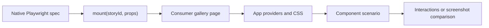

# Native component browser tests

Playwright **1.63.0** supplies `mount()` in `@playwright/test`. Use
`component_browser_test` from `@rules_web_e2e//component:defs.bzl` with the pinned
Testcontainers browser. No experimental React test
package or second bundler is needed. See the [Playwright component guide](https://playwright.dev/docs/test-components).



A consumer-owned gallery exposes `window.mount({story, props})` and
`window.unmount()`, rendering into `#root`. Its registry imports declared visual
modules. `.visual.tsx` declares `ComponentVisualModule` scenarios; the `story` field is part of
Playwright's native mount protocol. No Storybook integration is involved. Reuse the React root for prop updates, reject unknown stories and render
errors, and release the root on unmount. Put providers and callbacks in browser
stories; pass serializable props from specs. The runtime remains framework-free.

The [typed React gallery](../examples/react/gallery.tsx) uses the existing UI shell
and Vite adapter. The [component config](../examples/react/component.config.ts)
uses `componentBrowserConfig({root, gallery: "./gallery.html"})`, which selects
`*.browser.spec.ts` / `*.browser.spec.tsx` and resolves the gallery on the
application origin. Empty, cross-origin, credential-bearing, and fragment URLs
are rejected; the existing browser tunnel allowlist stays intact. It blocks service workers; explicitly override `use.serviceWorkers` to `"allow"`
if a fixture requires one. Declare visual modules,
HTML, config, CSS, generated assets, and dependencies in the target's inputs and
strict typecheck.

```ts
import {expect, test} from '@playwright/test'
import type {Counter} from './counter.visual'

test('retains state across prop updates', async ({mount}) => {
  const component = await mount<typeof Counter>('Counter/Default', {
    title: 'First',
  })
  await component.getByRole('button', {name: 'Increment'}).click()
  await component.update({title: 'Updated'})
  await expect(component.getByRole('status', {name: 'Count'})).toHaveText('1')
  await component.unmount()
  await expect(component).toBeEmpty()
})
```

VRT consumes the **same visual modules and gallery** through `visualConfig` and
`component_visual_test`. The runtime generates screenshot tests from each enabled
visual's `vrt` options and capture hooks. There are no separate consumer screenshot
specs. Independent VRT targets must own separate baseline directories.

```sh
cd examples/react
bazel test //:component_test //:component_visual_test
bazel run //:component_visual_test.update
```

## Migrating experimental component tests

| Previous convention                              | Playwright 1.63 convention                             |
| ------------------------------------------------ | ------------------------------------------------------ |
| Imports from `@playwright/experimental-ct-react` | `@playwright/test`                                     |
| `mount(<Widget ... />)` in Node                  | Browser fixture plus `mount('Widget/Scenario', props)` |
| `component.update(<Widget ... />)`               | `component.update(props)`                              |
| Node callbacks and JSX children                  | Browser-owned scenario; assert DOM or network effects  |
| Mount hooks and provider wrappers                | Consumer gallery shell and fixture setup               |
| `ctViteConfig` and CT-managed server             | Existing server adapter and its normal bundler config  |
| `*.browser.spec.tsx` with inline JSX             | `*.browser.spec.tsx` and typed `*.visual.tsx`          |

Existing JSX-based specs require migration; this is not a compatibility shim.
Large repositories can adapt an existing preview registry to the gallery
contract and retain their aliases, generated styles, auth fixtures, and CI
reporters internally. Keep both behavioral specs and VRT targets throughout the
migration. Playwright/browser pins must match at 1.63.0.

## Bazel target

```starlark
load("@rules_web_e2e//component:defs.bzl", "component_browser_test")

component_browser_test(
    name = "component_test",
    config = "component.config.ts",
    srcs = ["widget.browser.spec.ts", "widget.visual.tsx", "gallery.tsx", "gallery.html", "package.json"],
    server = ":server.js",
    playwright_test = "//:node_modules/@playwright/test/dir",
    playwright_core = "//:node_modules/playwright-core/dir",
    deps = [":browser_sources"],
    data = [":typecheck"],
)
```

Use the same `server`, `vite`/`server_config`, or `base_url`/`base_url_env`
options as E2E. `componentBrowserConfig` accepts `root`, `gallery`, and optional
`viewport`; compose native Playwright overrides with `defineConfig`. The target
has the `component_browser_test` tag and forwards the same selector flags as E2E.
It does not accept baseline options or create an update target.

E2E discovery excludes `*.browser.spec.ts` / `*.browser.spec.tsx`, so sharing a
source graph does not execute mount specs against the application homepage.
VRT generates its capture cases from the visual catalog and retains its baseline lifecycle.
