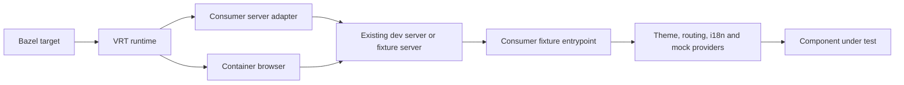

# Custom servers and UI shells

Server startup and component rendering are independent. The runtime owns input
staging, environment isolation, browser containers, artifacts, and teardown.
Consumers own the server implementation and the React/UI shell.



## Server interface

Use `vite` + `server_config` for the built-in Vite adapter, or supply `server`
as a Bazel label for a compiled TypeScript module. These options are mutually
exclusive with each other and with `base_url` / `base_url_env` for an existing
endpoint (see [remote mode](e2e.md#existing-application-urls)). Import `ServerAdapter` from `@rules-web-e2e/vrt/server` and export an
implementation as the module's default:

```ts
import type {ServerAdapter} from '@rules-web-e2e/vrt/server'

const start: ServerAdapter = async ({root, inputs, cache, host}) => {
  const server = await startProjectServer({root, inputs, cache, host, port: 0})
  await server.ready()
  return {url: server.url, close: () => server.close()}
}
export default start
```

`startProjectServer` above is consumer code. Return only after readiness, with
an HTTP URL on `127.0.0.1` and an explicit port. Base paths are supported. The
runtime passes the URL as `VRT_APP_URL`, exposes its host/port to the browser,
and invokes `close()` on termination. Adapters must clean up if startup throws.
All source imports, config, assets, and tools must be declared Bazel inputs.
`root` is the staged Playwright-config directory; `inputs` is the whole staged
runfiles tree, including cross-package libraries; `cache` is invocation-private.

Custom adapters run in the same clean child environment as the built-in adapter.
They must implement their own dotenv/config-discovery and filesystem policies;
the runtime cannot enforce Vite settings on an arbitrary server. An adapter can
launch a declared executable when a project already has a server command. It
must resolve that tool inside `inputs`, pass an explicit environment, wait for
readiness, and stop its children. Host code remains trusted and unsandboxed.

## UI shell

Import the shell in the browser fixture entrypoint and wrap the component using
the consumer's React version:

```tsx
root.render(
  <ProjectTestShell>
    <ComponentUnderTest />
  </ProjectTestShell>
)
```

Declare both files in `srcs` (or a transitive `js_library`). The OSS runtime has
no React dependency, provider conventions, or shell serialization protocol.
Playwright uses ordinary navigation and locators. Shells can supply theme,
i18n, routing, deterministic stores, and mocked data, independently of which
server serves the fixture. The standalone React example demonstrates this.

## Integration patterns

- A large monorepo can keep its aliases, CSS pipeline, test providers, and fixture
  registries behind a server adapter and shell. Serve selected fixture routes
  through the existing dev server; migrate tests to native Playwright locators
  and screenshot assertions. Keep application providers and service details in the
  consumer repository.
- A component library can serve a small gallery with theme, language, and
  direction providers while reusing its existing bundler and npm lockfile.

Both use the same screenshot comparison and update contract. External services
require explicit `network_origins` opt-ins; prefer declared fixture responses.

Native `mount()` uses the same server and shell through a consumer gallery; see
[component browser tests](component-browser.md).
