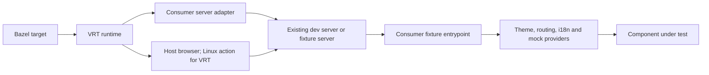

# Custom servers and UI shells

Server startup and component rendering independent. Runtime owns input
staging, environment isolation, host browser setup and Linux VRT actions, artifacts, and teardown.
Consumers own server implementation and React/UI shell.


```mermaid
flowchart LR
  Target[Bazel target] --> Runtime[VRT runtime]
  Runtime --> Adapter[Consumer server adapter]
  Adapter --> Server[Existing dev server or fixture server]
  Runtime --> Browser[Host browser; Linux action for VRT]
  Browser --> Server
  Server --> Entry[Consumer fixture entrypoint]
  Entry --> Shell[Theme, routing, i18n and mock providers]
  Shell --> Component[Component under test]
```

## Server interface

Supply `server` as target exporting one compiled TypeScript adapter module
and declaring its runtime dependencies. This replaces `shell`, `base_url`, or
`base_url_env` (see [remote mode](e2e.md#existing-application-urls)). Import
`ServerAdapter` from `@rules-web-e2e/vrt/server` and export it as default:

```ts
import type {ServerAdapter} from '@rules-web-e2e/vrt/server'

const start: ServerAdapter = async ({root, inputs, cache, host}) => {
  const server = await startProjectServer({root, inputs, cache, host, port: 0})
  await server.ready()
  return {url: server.url, close: () => server.close()}
}
export default start
```

`startProjectServer` above consumer code. Return only after readiness, with
HTTP URL on `127.0.0.1` and explicit port. Base paths supported.
runtime passes URL as `VRT_APP_URL`, exposes its host/port to browser,
and invokes `close()` on termination. Adapters must clean up if startup throws.
All source imports, config, assets, and tools must be declared Bazel inputs.
`root` staged target package directory; `inputs` whole staged
runfiles tree, including cross-package libraries; `cache` invocation-private.

Custom adapters run in same clean child environment as built-in static server.
They must implement their own dotenv/config-discovery and filesystem policies;
runtime cannot enforce discovery settings on arbitrary server. Adapter can
launch declared executable when project already has server command. It
must resolve that tool inside `inputs`, pass explicit environment, wait for
readiness, and stop its children. Host code follows Bazel's sandbox policy;
callsites can request `no-sandbox` when necessary.

## UI shell

Import shell in browser fixture entrypoint and wrap component using
consumer's React version:

```tsx
root.render(
  <ProjectTestShell>
    <ComponentUnderTest />
  </ProjectTestShell>
)
```

Build shell, template, styles, and other assets into one directory and
wrap it in `browser_shell` target. Build must depend on strict typechecks. OSS runtime has
no React dependency, provider conventions, or shell serialization protocol.
Built-in static server serves resulting files. Playwright uses ordinary
navigation and locators. Shells can supply theme,
i18n, routing, deterministic stores, and mocked data, independently of which
server serves fixture. Standalone React example demonstrates this.

## Integration patterns

- Large monorepo can keep its aliases, CSS pipeline, test providers, and fixture
  registries behind server adapter and shell. Serve selected fixture routes
  through existing dev server; migrate tests to native Playwright locators
  and screenshot assertions. Keep application providers and service details in
  consumer repository.
- Component library can serve small gallery with theme, language, and
  direction providers while reusing its existing bundler and npm lockfile.

Both use same screenshot comparison and update contract. External services in VRT
require explicit `network_origins` opt-ins; prefer declared fixture responses.

Native `mount()` uses same server and shell through consumer gallery; see
[component browser tests](component-browser.md).

## Serving a built application

Adapter can reuse static server while composing application-specific
startup or fixtures:

```ts
import path from 'node:path'
import {serveDirectory, type ServerAdapter} from '@rules-web-e2e/vrt/server'

const start: ServerAdapter = ({root}) =>
  serveDirectory(path.join(root, 'assets'))
export default start
```

Declare built `assets` directory in adapter target's data. Use
`inputs` and declared paths for artifacts from other packages. No source
compilation or npm installation occurs during browser execution.
