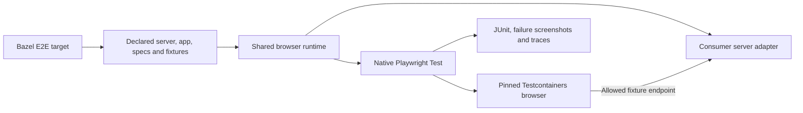

# End-to-end tests

`web_e2e_test` runs ordinary Playwright specs against a managed or existing application server.
Write clicks, navigation, form interactions, and assertions with `@playwright/test`.
No screenshot baseline or `.update` target is required.

```ts
import {expect, test} from '@playwright/test'

test('saves a draft', async ({page}) => {
  await page.goto('/')
  await page.getByRole('textbox', {name: 'Title'}).fill('My draft')
  await page.getByRole('button', {name: 'Save'}).click()
  await expect(page.getByText('Draft saved')).toBeVisible()
})
```

## Setup

Load `web_e2e_test` from `@rules_web_e2e//e2e:defs.bzl`. It takes the same
`playwright_test`, `playwright_core`, `config`, `srcs`, `deps`, `data`, server or remote URL,
environment, and network options as the visual target. Provide either a compiled
`server` adapter or `vite` plus `server_config`; see [customization](customization.md).
Do not pass baseline options. Wire a strict TypeScript check into `data`.

In a consumer config, compose the helper with native Playwright configuration:

```ts
import {defineConfig} from '@playwright/test'
import {e2eConfig} from '@rules-web-e2e/vrt'
import {fileURLToPath} from 'node:url'

export default defineConfig(
  e2eConfig({root: fileURLToPath(new URL('.', import.meta.url))}),
  {timeout: 45_000}
)
```

The existing Bazel-linked runtime package exports both config helpers; it needs
no npm publication. E2E discovers `*.spec.ts` and excludes `*.visual.spec.ts`.
`baseURL` is the ready server URL, also available as `VRT_APP_URL`. Relative URLs
follow normal Playwright URL resolution; use a relative path such as `./` when
preserving a server's base path. Keep custom fixtures, page objects, auth setup,
and imported helpers in declared inputs and the consumer typecheck.

```sh
# Standalone example
cd examples/react
bazel test //:e2e_test
bazel test //:e2e_test --test_arg=--grep=save
```

Selection flags `--grep`, `--grep-invert`, `--project`, and `--shard` are forwarded
through `--test_arg`. Configure other Playwright settings in the declared config;
CLI overrides of config, reporters, output paths, and snapshot updates are rejected.
No matching tests fail by default. Visual targets keep their separate full-capture
policy. See [the example BUILD file](../examples/react/BUILD.bazel).

## Execution and larger applications



The server adapter can coordinate an existing dev server and local test services,
returning one ready frontend URL and a cleanup callback. UI shells, provider setup,
route registries, and framework conventions remain in the consuming repository.
Page objects and `test.extend` fixtures work normally. Prefer `page.route` or local
fixture APIs for deterministic data; declare any authentication state files in
`data`. Keep credentials in explicitly declared environment variables rather
than checked-in state. Additional browser service origins require `network_origins`.

Like VRT, E2E is manual, local, uncached, and requires a local Docker daemon.
Server processes and browser resources are cleaned up after completion. Failures
return a nonzero status and preserve JUnit, screenshots, and traces in Bazel's
undeclared outputs. The host test process (including Playwright's `request`
fixture), custom server code, and setup scripts remain trusted and unsandboxed;
browser network restrictions do not sandbox Node requests. Remote endpoints are caller-owned; automatic backend provisioning and authentication
conventions remain consumer responsibilities.

FormatJS exercises the real editor with its custom Vite adapter and UI shell.
Its E2E specs check editing, search, validation, and saving, while the visual
target independently checks rendering against reviewed PNGs.

## Existing application URLs

Choose exactly one endpoint source: `server`, `vite` + `server_config`,
`base_url`, or `base_url_env`. For a deployed app, replace the server attributes:

```starlark
web_e2e_test(
    name = "deployed_test",
    base_url_env = "TEST_APP_URL",
    # config, srcs, deps, data and Playwright labels as above
    network_origins = ["https://auth.example.test"],
)
```

```sh
bazel test //path:deployed_test --test_env=TEST_APP_URL=https://preview.example.test/app/
```

`base_url_env` explicitly inherits that one variable; an unset or empty value
fails. For a fixed endpoint use `base_url = "https://preview.example.test/app/"`.
HTTP(S) paths and queries are preserved; credentials, fragments, and wildcard
hosts are rejected. Use `page.goto('./')` to retain a base path.

The runner starts no app process, performs no provisioning or health-check login,
and never stops the endpoint. Specs or consumer setup own readiness and auth.
Browser traffic is tunneled through the runner host, so that host must have the
required DNS/VPN access. The endpoint's host and port are allowed automatically;
redirects, API hosts, and identity providers need explicit `network_origins`.
Supply credentials through declared environment or private generated inputs.

The pinned browser, staged specs, clean environment, and artifacts are unchanged.
Live data and remote deployments are external inputs, so these tests remain
uncached and do not promise reproducible application state. The same endpoint
options work with VRT, whose `.update` remains explicit.

`//:remote_integration_test` in the React example starts an independent fixture
on a random port and verifies base paths, interactions, blocked undeclared
origins, and caller-owned server lifetime. CI needs no public test site.
