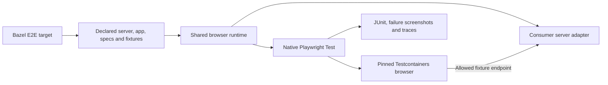

# End-to-end tests

`web_e2e_test` runs ordinary Playwright specs against a managed application server.
Write clicks, navigation, form interactions, and assertions with `@playwright/test`.
No screenshot baseline or `.update` target is required.

```ts
import {expect, test} from '@playwright/test'

test('saves a draft', async ({page}) => {
  await page.goto('/')
  await page.getByRole('textbox', {name: 'Title'}).fill('My draft')
  await page.getByRole('button', {name: 'Save'}).click()
  await expect(page.getByText('Draft saved')).toBeVisible()
})
```

## Setup

Load `web_e2e_test` from `@rules_web_e2e//e2e:defs.bzl`. It takes the same
`playwright_test`, `playwright_core`, `config`, `srcs`, `deps`, `data`, server,
environment, and network options as the visual target. Provide either a compiled
`server` adapter or `vite` plus `server_config`; see [customization](customization.md).
Do not pass baseline options. Wire a strict TypeScript check into `data`.

In a consumer config, compose the helper with native Playwright configuration:

```ts
import {defineConfig} from '@playwright/test'
import {e2eConfig} from '@rules-web-e2e/vrt'
import {fileURLToPath} from 'node:url'

export default defineConfig(
  e2eConfig({root: fileURLToPath(new URL('.', import.meta.url))}),
  {timeout: 45_000}
)
```

The existing Bazel-linked runtime package exports both config helpers; it needs
no npm publication. E2E discovers `*.spec.ts` and excludes `*.visual.spec.ts`.
`baseURL` is the ready server URL, also available as `VRT_APP_URL`. Relative URLs
follow normal Playwright URL resolution; use a relative path such as `./` when
preserving a server's base path. Keep custom fixtures, page objects, auth setup,
and imported helpers in declared inputs and the consumer typecheck.

```sh
# Standalone example
cd examples/react
bazel test //:e2e_test
bazel test //:e2e_test --test_arg=--grep=save
```

Selection flags `--grep`, `--grep-invert`, `--project`, and `--shard` are forwarded
through `--test_arg`. Configure other Playwright settings in the declared config;
CLI overrides of config, reporters, output paths, and snapshot updates are rejected.
No matching tests fail by default. Visual targets keep their separate full-capture
policy. See [the example BUILD file](../examples/react/BUILD.bazel).

## Execution and larger applications



The server adapter can coordinate an existing dev server and local test services,
returning one ready frontend URL and a cleanup callback. UI shells, provider setup,
route registries, and framework conventions remain in the consuming repository.
Page objects and `test.extend` fixtures work normally. Prefer `page.route` or local
fixture APIs for deterministic data; declare any authentication state files in
`data`. Keep credentials in explicitly declared environment variables rather
than checked-in state. Additional browser service origins require `network_origins`.

Like VRT, E2E is manual, local, uncached, and requires a local Docker daemon.
Server processes and browser resources are cleaned up after completion. Failures
return a nonzero status and preserve JUnit, screenshots, and traces in Bazel's
undeclared outputs. The host test process (including Playwright's `request`
fixture), custom server code, and setup scripts remain trusted and unsandboxed;
browser network restrictions do not sandbox Node requests. Existing remote
servers, automatic backend provisioning, and authentication conventions are not
managed by this initial target.

FormatJS exercises the real editor with its custom Vite adapter and UI shell.
Its E2E specs check translation editing and test-owned API responses, while the
visual target independently checks rendering against reviewed PNGs.
