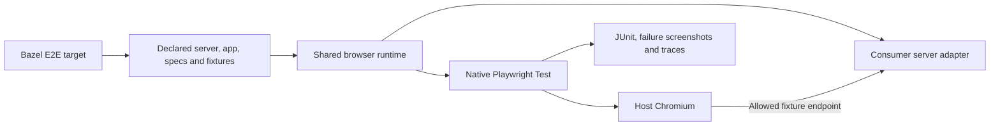

# End-to-end tests

`web_e2e_test` runs ordinary Playwright specs against a managed or existing application server.
Write clicks, navigation, form interactions, and assertions with `@playwright/test`.
No screenshot baseline or `.update` target is required.

```ts
import {expect, test} from '@playwright/test'

test('saves a draft', async ({page}) => {
  await page.goto('/')
  await page.getByRole('textbox', {name: 'Title'}).fill('My draft')
  await page.getByRole('button', {name: 'Save'}).click()
  await expect(page.getByText('Draft saved')).toBeVisible()
})
```

## Setup

Compile `*.spec.ts` with strict typechecking and declare its runtime dependencies.
Pass the resulting target and a compiled server adapter to `web_e2e_test`:

```starlark
load("@rules_web_e2e//e2e:defs.bzl", "web_e2e_test")

web_e2e_test(
    name = "e2e_test",
    tests = ":compiled_specs",
    server = ":app_test_server",
)
```

For an existing Playwright setup, pass `config = ":compiled_config"` instead of
`server`. Set `use.baseURL` and optional `webServer` in that config; Playwright
starts and stops the declared server. Declare its executable and assets as data.
A built `shell` or existing URL is also supported. See the
[setup guide](getting-started.md) and [all attributes](api.md).
The runner selects emitted `*.spec.js`, excluding component/visual specs.
It supplies `baseURL` and `VRT_APP_URL`; use `page.goto('./')` to preserve a
server base path. Most consumers need no Playwright config. Pass an optional
compiled config for custom fixtures, timeouts, global setup, or E2E projects.

```sh
# After materializing the launcher in Getting started
cd examples/react
.web-e2e/run test //:e2e_test
.web-e2e/run test //:e2e_test --test_arg=--grep=save
```

Selection flags `--grep`, `--grep-invert`, `--project`, and `--shard` are forwarded
through `--test_arg`. Configure other Playwright settings in the declared config;
Add custom reporters through the [compiled Playwright config](api.md#optional-playwright-configuration). CLI overrides of config, reporters, output paths, and snapshot updates are rejected.
No matching tests fail by default. Visual targets keep their separate full-capture
policy. See [the example BUILD file](../examples/react/BUILD.bazel).

## Execution and larger applications



The server adapter can coordinate an existing dev server and local test services,
returning one ready frontend URL and a cleanup callback. UI shells, provider setup,
route registries, and framework conventions remain in the consuming repository.
Page objects and `test.extend` fixtures work normally. Prefer `page.route` or local
fixture APIs for deterministic data; declare any authentication state files in
`data`. Keep credentials in explicitly declared environment variables rather
than checked-in state. Host browsers use host networking; VRT uses separate offline Linux actions.

E2E is manual, local, and uncached. It requires a provisioned host browser, not
Docker; see [host setup](host-browsers.md).
Server processes and browser resources are cleaned up after completion. Failures
return a nonzero status and preserve JUnit, screenshots, and traces in Bazel's
undeclared outputs. The host test process (including Playwright's `request`
fixture), custom server code, and setup scripts remain trusted and unsandboxed;
host browser and Node requests use host networking. Remote endpoints are caller-owned; automatic backend provisioning and authentication
conventions remain consumer responsibilities.

## Existing application URLs

Choose exactly one endpoint source: `server`, `shell`,
`base_url`, or `base_url_env`. For a deployed app, replace the server attributes:

```starlark
web_e2e_test(
    name = "deployed_test",
    base_url_env = "TEST_APP_URL",
    tests = ":compiled_specs",
)
```

```sh
bazel test //path:deployed_test --test_env=TEST_APP_URL=https://preview.example.test/app/
```

`base_url_env` explicitly inherits that one variable; an unset or empty value
fails. For a fixed endpoint use `base_url = "https://preview.example.test/app/"`.
HTTP(S) paths and queries are preserved; credentials, fragments, and wildcard
hosts are rejected. Use `page.goto('./')` to retain a base path.

The runner starts no app process, performs no provisioning or health-check login,
and never stops the endpoint. Specs or consumer setup own readiness and auth.
Browser traffic originates on the runner host, which must have the required
DNS/VPN access. E2E does not enforce an origin allowlist.
Supply credentials through declared environment or private generated inputs.

The version-matched host browser, staged specs, clean environment, and artifacts
are shared with local E2E.
Live data and remote deployments are external inputs, so these tests remain
uncached and do not promise reproducible application state. VRT fixtures must run inside their Linux action; deployed URLs belong in host E2E.

`//:remote_integration_test` in the React example starts an independent fixture
on a random port and verifies base paths, interactions, host-network
access and caller-owned server lifetime. CI needs no public test site.

## Interaction-driven visual tests

Use `visual_test` from `@rules_web_e2e//vrt:defs.bzl` for ordinary Playwright specs
that click around and call `expect(page).toHaveScreenshot('saved.png')`. Pass the
compiled specs, config (or server/shell/URL), matching policy, and baseline inputs.
`bazel run //:visual_test.update` replaces baselines only after the full suite succeeds.
The [native example](../examples/react/native.visual.spec.ts) exercises this path.

VRT requires a declared `browser` and action-local fixture services. See
[actiond execution](actiond.md); external origin exceptions are unsupported.

## Suite selection belongs to Bazel

Explicit `testMatch`, `testIgnore`, and `testDir` settings are rejected at the
config and project level. Declare preselected compiled specs through `tests`.
Projects can vary execution settings (such as viewport) over that same suite.
For independent suites, use separate targets and configs without discovery filters:

```starlark
web_e2e_test(name = "auth_test", tests = ":compiled_auth_specs", config = ":config")
web_e2e_test(name = "app_test", tests = ":compiled_app_specs", config = ":config")
```

If authentication is setup rather than a test suite, put it in an app-suite
fixture. Bazel tests do not order other tests or consume their mutable outputs.
Declare hermetically generated static fixture files through `data` instead.
