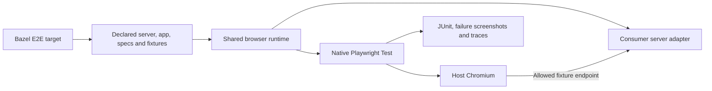

# End-to-end tests

`web_e2e_test` runs ordinary Playwright specs against managed or existing application server.
Write clicks, navigation, form interactions, and assertions with `@playwright/test`.
No screenshot baseline or `.update` target required.

```ts
import {expect, test} from '@playwright/test'

test('saves a draft', async ({page}) => {
  await page.goto('/')
  await page.getByRole('textbox', {name: 'Title'}).fill('My draft')
  await page.getByRole('button', {name: 'Save'}).click()
  await expect(page.getByText('Draft saved')).toBeVisible()
})
```

## Setup

Compile `*.spec.ts` with strict typechecking and declare its runtime dependencies.
Pass resulting target and compiled server adapter to `web_e2e_test`:

```starlark
load("@rules_web_e2e//e2e:defs.bzl", "web_e2e_test")

web_e2e_test(
    name = "e2e_test",
    tests = ":compiled_specs",
    server = ":app_test_server",
)
```

For existing Playwright setup, pass `config = ":compiled_config"` instead of
`server`. Set `use.baseURL` and optional `webServer` in that config; Playwright
starts and stops declared server. Declare its executable and assets as data.
The Playwright config load resolves the URL; no separate config-reader process.
Built `shell` or existing URL also supported. See
[setup guide](getting-started.md) and [all attributes](api.md).
Runner selects emitted `*.spec.js`, excluding component/visual specs.
It supplies `baseURL` and `VRT_APP_URL`; use `page.goto('./')` to preserve
server base path. Most consumers need no Playwright config. Pass optional
compiled config for custom fixtures, timeouts, global setup, or E2E projects.

```sh
# After materializing the launcher in Getting started
cd examples/react
.web-e2e/run test //:e2e_test
.web-e2e/run test //:e2e_test --test_arg=--grep=save
```

Selection flags `--grep`, `--grep-invert`, `--project`, and `--shard` forwarded
through `--test_arg`. Configure other Playwright settings in declared config;
Add custom reporters through [compiled Playwright config](api.md#optional-playwright-configuration). CLI overrides of config, reporters, output paths, and in-place snapshot updates rejected.

## Snapshot updates

Host E2E, component, and process-owned targets can own snapshots:

```starlark
web_e2e_test(
    name = "e2e_test",
    tests = ":compiled_specs",
    config = ":compiled_config",
    snapshot_dir = "snapshots",
    snapshots = glob(["snapshots/**"], allow_empty = True),
)
```

```sh
bazel run //path:e2e_test.update
bazel run //path:e2e_test.update --@rules_web_e2e//:snapshot_filter=checkout
bazel test //path:e2e_test
```

`snapshot_dir` package-relative; define update targets in consuming workspace. Normal tests read declared `snapshots`;
`<name>_snapshot_capture` builds declared tree containing existing baselines plus successful captures.
`.update` applies that tree with `write_source_files`. Building alone never changes sources.
Missing/mismatched baselines fail normal tests. Failed or empty captures apply nothing.
Filtered updates preserve unselected declared files. Declare entire snapshot directory.
Undeclared files or edits since capture block application. Use separate directories per target.
Updates share VRT lock and change checks; directory replacement not atomic. Review diffs before committing.

Capture runs locally. Unchanged build inputs can reuse previous capture. Set
`--@rules_web_e2e//:snapshot_refresh=<new-value>` to recapture after host or service changes.
Selection belongs in `snapshot_filter` or target `args`, not arguments after `--`.
For inherited browser installation, pass `--action_env=PLAYWRIGHT_BROWSERS_PATH`
to build/run; likewise forward any required inherited environment variables.

Layout: `default/<compiled-spec-path>-snapshots/<snapshot-name>`, or
`project-<URL-encoded-project-name>/...` for configured projects. Screenshot names
retain Playwright's platform suffix. Managed paths override caller snapshot templates,
including screenshot/ARIA matcher templates. Existing custom layouts need migration.
No source filename guessing or consumer-specific paths.

For export only, use `bazel test //path:e2e_test --test_arg=--export-snapshots`.
Captures stay under `test.outputs/snapshots/` using same layout.
`snapshot-sources.json` maps compiled spec paths to declared runfiles paths.
Export alone never applies files. `snapshot_dir` optional for export.

Isolated browser tests support export only. Visual targets retain full-suite `.update`
and `baseline_dir`; they reject snapshot export and `snapshot_dir`.

No matching tests fail by default. Visual targets keep their separate full-capture
policy. See [the example BUILD file](../examples/react/BUILD.bazel).

## Execution and larger applications


```mermaid
flowchart LR
  Target[Bazel E2E target] --> Inputs[Declared server, app, specs and fixtures]
  Inputs --> Runtime[Shared browser runtime]
  Runtime --> Server[Consumer server adapter]
  Runtime --> Tests[Native Playwright Test]
  Tests --> Browser[Host Chromium]
  Browser -->|Allowed fixture endpoint| Server
  Tests --> Results[JUnit, failure screenshots and traces]
```

Server adapter can coordinate existing dev server and local test services,
returning one ready frontend URL and cleanup callback. UI shells, provider setup,
route registries, and framework conventions remain in consuming repository.
Page objects and `test.extend` fixtures work normally. Prefer `page.route` or local
fixture APIs for deterministic data; declare any authentication state files in
`data`. Keep credentials in explicitly declared environment variables rather
than checked-in state. Host browsers use host networking; VRT uses separate offline Linux actions.

E2E manual, local, and uncached by default. It requires provisioned host browser, not
Docker; see [host setup](host-browsers.md).
Server processes and browser resources cleaned up after completion. Failures
return nonzero status and preserve JUnit, screenshots, and traces in Bazel's
undeclared outputs. Host test process (including Playwright's `request`
fixture), custom server code, and setup scripts remain trusted and unsandboxed;
host browser and Node requests use host networking. Remote endpoints caller-owned; automatic backend provisioning and authentication
conventions remain consumer responsibilities.

## Opt-in local result caching

Fully mocked host E2E/component suites can set `cacheable = True`. Unchanged
inputs reuse local results. Defaults stay uncached; remote caching stays disabled.

```starlark
load("@rules_web_e2e//playwright:browser.bzl", "playwright_browser_installation")

playwright_browser_installation(
    name = "browsers",
    chromium = "@rules_browsers_chrome_linux//:info",
    ffmpeg = ":downloaded_ffmpeg",
    playwright = ":playwright",
)

web_e2e_test(
    name = "local_e2e_test",
    tests = ":compiled_specs",
    server = ":app_test_server",
    playwright = ":playwright",
    data = [":browsers", ":mock_fixtures"],
    env = {"PLAYWRIGHT_BROWSERS_PATH": "$(rootpath :browsers)"},
    cacheable = True,
)
```

Use caller-pinned browser downloads; see [browser provisioning](host-browsers.md#assemble-an-existing-browser-download).
Declare specs, app assets, servers, mocks, fixtures, and browser files. Mock external
services, including calls from Node setup/server code. Reject unexpected requests.

`cacheable = True` promises results depend on declared inputs plus controlled
host environment. Rules cannot verify mocks or browser pinning. Explicit
`PLAYWRIGHT_BROWSERS_PATH` prevents implicit browser inheritance; it does not
prove browser files declared. Live URLs hidden in config remain undeclared inputs.

Unsupported: `browser`, visual/process-owned modes, URL attributes, `env_inherit`.
Host execution stays manual, unsandboxed, and network-enabled. After host OS/library
changes, force execution with `--cache_test_results=no`. Caller `no-cache` or
`external` tags still disable reuse.

## Runtime-only inputs

`runtime_only` defaults to `True`, keeping source/type/debug files out of compiled
`tests`, `config`, `server`, and `matching` runfiles. Set it to `False` to restore
unfiltered compiled inputs, including sources and maps used for debugging.
The option applies to the shared browser rules, independently of `cacheable`.

```starlark
web_e2e_test(
    name = "e2e_test",
    tests = ":compiled_specs",
    config = ":compiled_config",
    runtime_only = False,  # Retain source/debug inputs for this suite.
)
```

This excludes individual `.ts`, `.tsx`, `.mts`, `.cts`, `.map`, and
`.tsbuildinfo` files owned by the test target's repository, including TypeScript
declarations. Emitted JavaScript, runtime assets, and their runfile aliases
remain. Directory artifacts owned by the test's repository are copied without
`*.map` files, including nested maps, while preserving their runfiles paths and
aliases. This also applies to built `browser_shell` assets. Other files within
directories are preserved. A map-only change may rerun the copy action without
invalidating the browser result when the projected contents are identical.
Other repositories' files, browser/runtime packages, explicit `data`, and snapshot
inputs are not filtered. Explicit `data` wins when the same directory also appears
in compiled inputs. Declare a
source file or map in `data` if the test intentionally reads it.

When result caching is enabled, erased type edits or source-map changes can
reuse passing browser results if all runtime inputs remain identical. Upstream
build actions may still run. Changes that affect emitted JavaScript must
invalidate results. Keep separate typecheck targets enabled; runtime filtering
does not validate types. Excluding maps can also remove mapped stack traces for
those modules, so set `runtime_only = False` when source-level debugging is required.

This option does not enable caching, make a live service deterministic, or
change execution/network policy. See the caching contract above.

## Existing application URLs

Choose exactly one endpoint source: `server`, `shell`,
`base_url`, or `base_url_env`. For deployed app, replace server attributes:

```starlark
web_e2e_test(
    name = "deployed_test",
    base_url_env = "TEST_APP_URL",
    tests = ":compiled_specs",
)
```

```sh
bazel test //path:deployed_test --test_env=TEST_APP_URL=https://preview.example.test/app/
```

`base_url_env` explicitly inherits that one variable; unset or empty value
fails. For fixed endpoint use `base_url = "https://preview.example.test/app/"`.
HTTP(S) paths and queries preserved; credentials, fragments, and wildcard
hosts rejected. Use `page.goto('./')` to retain base path.

Runner starts no app process, performs no provisioning or health-check login,
and never stops endpoint. Specs or consumer setup own readiness and auth.
Browser traffic originates on runner host, which must have required
DNS/VPN access. E2E does not enforce origin allowlist.
Supply credentials through declared environment or private generated inputs.

Version-matched host browser, staged specs, clean environment, and artifacts
 shared with local E2E.
Live data and remote deployments external inputs, so these tests remain
uncached and do not promise reproducible application state. VRT fixtures must run inside their Linux action; deployed URLs belong in host E2E.

`//:remote_integration_test` in React example starts independent fixture
on random port and verifies base paths, interactions, host-network
access and caller-owned server lifetime. CI needs no public test site.

## Interaction-driven visual tests

Use `visual_test` from `@rules_web_e2e//vrt:defs.bzl` for ordinary Playwright specs
that click around and call `expect(page).toHaveScreenshot('saved.png')`. Pass
compiled specs, config (or server/shell/URL), matching policy, and baseline inputs.
`bazel run //:visual_test.update` replaces baselines only after full suite succeeds.
[native example](../examples/react/native.visual.spec.ts) exercises this path.

VRT requires declared `browser` and action-local fixture services. See
[actiond execution](actiond.md); external origin exceptions unsupported.

## Suite selection belongs to Bazel

Explicit `testMatch`, `testIgnore`, and `testDir` settings rejected at
config and project level. Declare preselected compiled specs through `tests`.
Projects can vary execution settings (such as viewport) over that same suite.
For independent suites, use separate targets and configs without discovery filters:

```starlark
web_e2e_test(name = "auth_test", tests = ":compiled_auth_specs", config = ":config")
web_e2e_test(name = "app_test", tests = ":compiled_app_specs", config = ":config")
```

If authentication setup rather than test suite, put it in app-suite
fixture. Bazel tests do not order other tests or consume their mutable outputs.
Declare hermetically generated static fixture files through `data` instead.

## Process-owned tests

Use `browser_process_test` from `@rules_web_e2e//e2e:defs.bzl` for compiled
Playwright specs that launch their own Electron app or persistent browser process.
Pass compiled `tests`, optional compiled `config`, and executable runfiles in `data`.
Rule does not provision Chromium, discover application URL, or override
native launch settings. Caller owns executable selection and any native
Playwright `webServer` setup. It host execution, not sandboxed browser mode.

Bazel still owns spec selection, timeouts, output reports, and scratch cleanup.
Fixtures must close their browser/context during normal teardown. Runner
snapshots descendant process groups before timeout/cancellation, terminates them,
and waits before deleting scratch. Host process suites require `/bin/ps` (Linux/macOS).
Callers remain responsible for processes that reparent themselves before cleanup.
Do not set `testDir`, `testMatch`, or `testIgnore` in compiled config. `browser`, `server`, `shell`, and base-URL rule options not
supported; use `web_e2e_test` for managed browser/server execution.
Process-owned suites run with runfiles workspace as their working directory,
so `$(rootpath ...)` values in declared environment variables resolve without
depending on config package's location. Runtime `data` stays in runfiles;
native executables not copied into test package.

## Bazel selection

Set `shard_count` on the test target. Bazel shard indices map to Playwright shards.
Use `bazel test --test_filter=<regex>` to select test names. Do not combine it with
`--test_arg=--grep`; do not combine Bazel sharding with `--test_arg=--shard`.
Snapshot updates require the full baseline set. JUnit goes to Bazel’s `test.xml`.

Bazel test deadlines use `timeout` or `--test_timeout`. The runtime adds no second
whole-suite timer under `bazel test`. Playwright still owns per-test timeouts.
`execution_timeout_seconds` bounds capture actions and standalone invocations.

Native snapshot capture writes only new snapshots. A declared `copy_to_directory`
action overlays them on the `snapshots` inputs, then `.update` uses the guarded
source writer. Filtered updates keep uncaptured snapshots without runtime copying.
