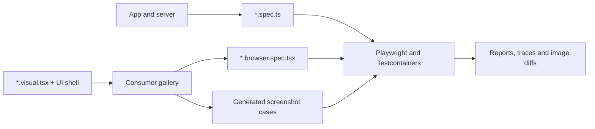

# Getting started

Use `web_e2e_test` for app flows, `component_browser_test` for mounted component
interactions, and `component_visual_test` for screenshots. Component behavior
and VRT can share one gallery and the same `.visual.tsx` modules.



## Run the example

Install Bazelisk and start a local Docker daemon. Linux amd64 is the validated
screenshot platform; a remote Docker daemon is not supported. The consumer
requires the Playwright version matching the pinned image, currently `1.63.0`.

From a checkout of this repository:

```sh
cd examples/react
bazelisk test //:e2e_test //:component_test //:component_visual_test
```

The example is an independent Bazel module with its own npm lockfile. Bazel
fetches dependencies; a separate npm installation is not needed to run it.
See the [pinned dependency versions](dependencies.md).

## Connect a consumer

Use the example's [MODULE.bazel](../examples/react/MODULE.bazel),
[package.json](../examples/react/package.json), and
[BUILD.bazel](../examples/react/BUILD.bazel) as the complete working setup.
The example uses a local override for development. For a standalone consumer,
use the public v1.0.0 release archive without waiting for BCR availability:

```starlark
bazel_dep(name = "rules_web_e2e", version = "1.0.0")
archive_override(
    module_name = "rules_web_e2e",
    integrity = "sha256-L/toWJAXm9/AbUgbk2OrEpzUDGMLWcLiCIxEKCyCCVw=",
    strip_prefix = "rules_web_e2e-1.0.0",
    urls = ["https://github.com/perplexityai/rules_web_e2e/releases/download/v1.0.0/rules_web_e2e-v1.0.0.tar.gz"],
)
```

When your chosen version is available in BCR, omit `archive_override`.
Do not combine archive and local overrides for the same module.

1. Add `rules_web_e2e`, `aspect_rules_js`, and `aspect_rules_ts` to your module.
   Translate your npm lockfile and configure the TypeScript toolchain.
2. Pin `@playwright/test`, `playwright`, and `playwright-core` to the matching
   version. Add your renderer and bundler dependencies to the same lockfile.
3. Create npm links in the consumer package, including the rules' Bazel-built
   runtime package. No separately published npm runtime is required:

```starlark
load("@aspect_rules_js//npm:defs.bzl", "npm_link_package")
load("@npm//:defs.bzl", "npm_link_all_packages")

npm_link_all_packages(name = "node_modules")
npm_link_package(
    name = "node_modules/@rules-web-e2e/vrt",
    src = "@rules_web_e2e//runtime:package",
)
```

4. Declare a strict `ts_project` covering configs, specs, gallery, and imports.
   Include npm/type dependencies. With `no_emit = True`, expose its typecheck
   outputs explicitly and put the resulting target in every browser target's `data`:

```starlark
filegroup(
    name = "typecheck",
    srcs = [":typecheck_project"],
    output_group = "transitive_typecheck",
)
```

See the example's [tsconfig.json](../examples/react/tsconfig.json). Vite
transpilation alone does not typecheck. Declare `package.json` with `"type": "module"`
for ESM TypeScript configs, all imported sources/assets, and runtime npm links.
Use transitive `js_library` dependencies for cross-package sources.

## Add an E2E target

Create `e2e.config.ts` using [e2eConfig](e2e.md#setup) and write `*.spec.ts`
files with native Playwright assertions. A Vite-backed target looks like this;
replace the app/spec filenames and dependency list with your own declared inputs:

```starlark
load("@rules_web_e2e//e2e:defs.bzl", "web_e2e_test")

web_e2e_test(
    name = "e2e_test",
    config = "e2e.config.ts",
    srcs = ["app.tsx", "index.html", "app.spec.ts", "package.json"],
    playwright_test = ":node_modules/@playwright/test/dir",
    playwright_core = ":node_modules/playwright-core/dir",
    vite = ":node_modules/vite/dir",
    server_config = "vite.config.ts",
    deps = [
        ":node_modules/@rules-web-e2e/vrt",
        ":node_modules/@playwright/test",
        ":node_modules/playwright",
        ":node_modules/vite",
        ":node_modules/react",
        ":node_modules/react-dom",
    ],
    data = [":typecheck"],
)
```

For an existing server, replace the Vite pair with a [server adapter](customization.md)
or [explicit URL](e2e.md#existing-application-urls). The [API reference](api.md)
lists all attributes, environment options, and network restrictions.

## Add component behavior and VRT

Create a `.visual.tsx` module and import it into a gallery entrypoint that calls
`installVisualGallery`. Supply `#root` in the gallery HTML. The working
[visual module](../examples/react/counter.visual.tsx) and
[React gallery](../examples/react/gallery.tsx) demonstrate providers, readiness,
render errors, and mount updates.

For interactions, pair `component_browser_test` with
`componentBrowserConfig({root, gallery: './gallery.html'})` and write
`*.browser.spec.tsx` files. See the [component guide](component-browser.md).

For VRT, pair `component_visual_test` with a separate config:

```ts
import {defineConfig} from '@playwright/test'
import {visualConfig} from '@rules-web-e2e/vrt'
import {fileURLToPath} from 'node:url'

const defaults = visualConfig({
  root: fileURLToPath(new URL('.', import.meta.url)),
})
export default defineConfig(defaults, {
  use: {
    baseURL: new URL('./gallery.html', defaults.use!.baseURL).href,
    serviceWorkers: 'block',
  },
})
```

Declare the gallery and module inputs in both targets. VRT generates tests from
the registered modules; do not write separate screenshot specs. Add `baselines`
and a unique `baseline_dir` only to the visual target. The example's
[BUILD file](../examples/react/BUILD.bazel) wires both targets to the same sources.

```sh
bazelisk run //:component_visual_test.update
# Review and commit the generated PNGs, then verify comparison.
bazelisk test //:component_visual_test
```

Updates replace the complete target's PNG set and remove stale PNGs after a
successful capture. Do not share baseline directories or run concurrent updates.

## CI and troubleshooting

Browser targets are `manual`: `bazel test //...` does not select them. List them
explicitly in a Docker-enabled job and upload `bazel-testlogs/` even on failure.
The [repository CI workflow](../.github/workflows/ci.yaml) is a working example.

| Symptom                                    | Check                                                                                   |
| ------------------------------------------ | --------------------------------------------------------------------------------------- |
| Missing `VRT_*` environment                | Run the Bazel target instead of invoking Playwright directly                            |
| Docker connection or image startup failure | Start a local daemon and verify its connection settings and image access                |
| Missing imports/assets                     | Add files, generated outputs, npm links, and cross-package libraries to declared inputs |
| No component specs run                     | Use `componentBrowserConfig` and `*.browser.spec.ts` or `*.browser.spec.tsx`            |
| Empty visual catalog                       | Register at least one module whose visual does not set `vrt: false`                     |
| Blocked browser request                    | Vendor/mock the resource or declare its exact origin in `network_origins`               |
| Screenshot mismatch                        | Inspect expected/actual/diff attachments; update only intentional changes               |
| Timeout                                    | Check server readiness, capture hooks, Playwright timeout, and runner/Bazel deadlines   |

JUnit, failure traces, and screenshots are under Bazel's undeclared test outputs.
Failed updates print their artifact directory and leave existing source baselines
intact. See [VRT stability](testcontainers-vrt.md) for the limits of reproducibility.
