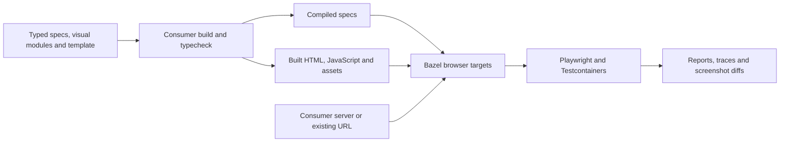

# Getting started

Use `web_e2e_test` for app flows, `component_browser_test` for mounted component
interactions, and `component_visual_test` for screenshots. The latter two share
a built gallery containing your `.visual.tsx` modules and UI shell.



## Run the example

Install Bazelisk and start a local Docker daemon. Linux amd64 is the validated
screenshot platform; remote Docker daemons are not supported.

```sh
cd examples/react
bazelisk test //:e2e_test //:component_test //:component_visual_test
```

Bazel fetches locked dependencies, compiles specs, checks types, and builds the
shell before execution. See the complete [BUILD file](../examples/react/BUILD.bazel)
and [module setup](../examples/react/MODULE.bazel). This interface is newer than
1.0.0: use this checkout via `local_path_override` or the corresponding released
version once available. Do not use the 1.0.0 archive with these signatures.

## Connect a consumer

1. Add `rules_web_e2e`, `rules_js`, and your TypeScript rules to the build graph.
   Translate your existing npm lockfile. Pin Playwright >=1.63.0 to match your
   selected runtime; the rules default to 1.63.0.
2. Bazel-link the runtime package for visual modules, matching, and server types:

```starlark
load("@aspect_rules_js//npm:defs.bzl", "npm_link_package")

npm_link_package(
    name = "node_modules/@rules-web-e2e/vrt",
    src = "@rules_web_e2e//runtime:package",
)
```

3. Build specs as ESM JavaScript with strict typechecking and declared runtime
   dependencies. Pass a `ts_project` or `js_library` of its emitted outputs as
   `tests`. E2E selects `*.spec.js`; component tests select `*.browser.spec.js`.
   Include module markers and imported helpers in the target's dependencies.
4. Build the gallery using your existing pipeline. It must produce one directory
   containing HTML, JS, CSS, and other assets. Make typechecking a prerequisite
   of that build. Wrap it in `browser_shell(assets = ":bundle", ...)`.
5. Declare the test targets shown in the [README](../README.md#api). No Vite,
   bundler config, npm runner directories, or raw app sources belong on them.

The example uses Vite only as a consumer build tool in
[build-shell.ts](../examples/react/build-shell.ts). Another bundler or template
pipeline can produce the same artifact contract without changing the rules.

For an existing app, supply a compiled [server adapter](customization.md) or
an [explicit URL](e2e.md#existing-application-urls). For component tests, the
built entry point calls `installVisualGallery` with modules and a renderer;
see the [React gallery](../examples/react/gallery.tsx).

## VRT matching and updates

Compile a module exporting `VisualMatching` and pass it as `matching`.
Use `threshold` for per-pixel color tolerance, and either `maxDiffPixels` or
`maxDiffPixelRatio` for the allowed mismatch budget. Defaults are threshold
0.1 and zero mismatched pixels. See the [matching reference](api.md#vrt-matching).

```sh
bazelisk run //:component_visual_test.update
# Review and commit the PNG diff, then compare.
bazelisk test //:component_visual_test
```

Updates replace the complete target's PNG set and delete stale PNGs only after
a successful capture. Do not share baseline directories or run concurrent updates.

## CI and troubleshooting

Browser targets are `manual`: `bazel test //...` does not select them. List them
explicitly in a Docker-enabled job and upload `bazel-testlogs/` on failure.
The [CI workflow](../.github/workflows/ci.yaml) is a working example.

| Symptom                     | Check                                                                             |
| --------------------------- | --------------------------------------------------------------------------------- |
| Rejected source inputs      | Pass emitted `.js` specs or a compiled server/config/matching module              |
| Missing shell entry         | Check the built directory contains the declared HTML and all referenced assets    |
| Playwright version mismatch | Align compiler dependencies, runtime packages, and pinned browser image           |
| Docker startup failure      | Start a local daemon and check its connection settings and image access           |
| Missing imports             | Declare helpers, npm links, module markers, and generated outputs in the producer |
| Empty visual catalog        | Register a module with at least one visual that does not set `vrt: false`         |
| Blocked browser request     | Vendor/mock the resource or add its exact origin to `network_origins`             |
| Screenshot mismatch         | Inspect expected/actual/diff attachments and approve only intentional changes     |

## Migrating from 1.0.0

| Previous call-site input                                            | Replacement                                                                    |
| ------------------------------------------------------------------- | ------------------------------------------------------------------------------ |
| `srcs`, `deps`, typecheck in `data`                                 | A built `tests` target and built shell; producer owns compilation/typechecking |
| `vite`, `server_config`                                             | Consumer build action producing a directory, wrapped in `browser_shell`        |
| `playwright_test`, `playwright_core`, `image`, `playwright_version` | One reusable `playwright_runtime`, selected with `playwright`                  |
| Required Playwright config                                          | Generated defaults; optional compiled config for advanced fixtures/timeouts    |
| `visualConfig({tolerance})`                                         | Compiled `VisualMatching` module selected with `matching`                      |

Existing compiled `ServerAdapter` implementations and remote URL options remain
supported. `ServerContext.root` now refers to the target package, not a supplied
config's directory. Keep visual IDs and screenshot names stable; moving bundling
to a build action does not itself require approving new baselines.
