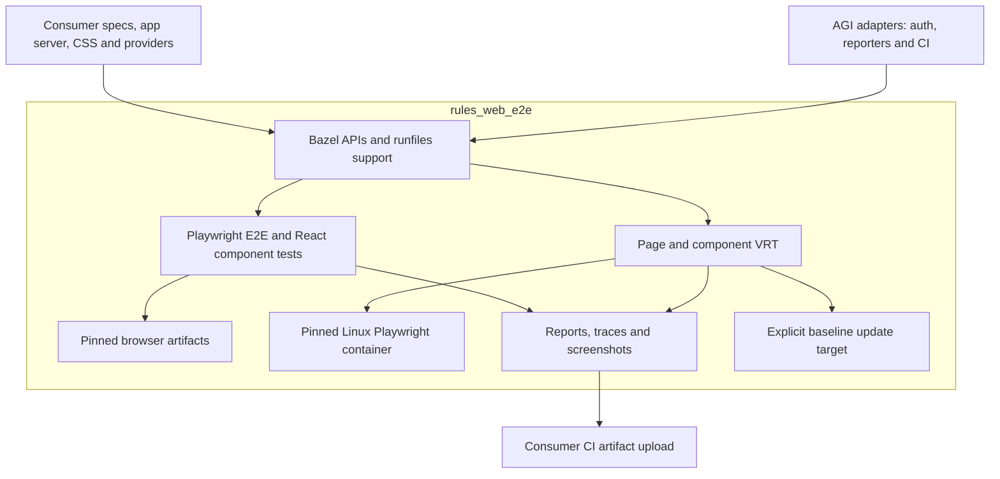

# Plan: extract AGI browser testing into rules_web_e2e

Proposed scope: reusable Bazel rules and browser-test runtime, with AGI retained
as a consumer. Ship through this repo’s existing BCR release pipeline. This is
an extraction plan; the repo currently contains only packaging smoke tests.

## What exists

Reviewed AGI at `fe8ee9989baacbe616dd621cc854de98e2ab13fc`.

| Surface | Current implementation | Extract |
| --- | --- | --- |
| Playwright foundation | [`pplx_playwright_test`][playwright] wires npm runner, browser runfiles, temporary HOME, and loader settings. | Generic runner with explicit config, dependencies, browser targets, and environment. |
| Web E2E | [`pplx_e2e_test`][e2e] supports a local server or deployed URL, desktop/mobile projects, setup, and artifacts. | Server lifecycle, URL selection, runfiles resolution, and standard reports. |
| Component browser | [`pplx_component_browser_test`][playwright] uses Playwright React component testing, typechecking, and [Vite configuration][ct]. | React mount tests with consumer-owned Vite/CSS/provider setup. |
| VRT | [Rules][vrt] generate page screenshot specs and component visual-module specs, compare baselines, and expose `.update` targets. [Component VRT][component-vrt] uses Vitest browser mode; page VRT uses Playwright. Both use a [Linux browser container][container]. | Visual-module discovery, rendering hooks, capture/diff outputs, and explicit baseline updates. |

## Proposed boundary

- **Public API:** propose `playwright_test`, `web_e2e_test`,
  `component_browser_test`, `component_visual_module`, `component_visual_test`,
  and `web_visual_test`. Start from current `component-vrt`; defer the older
  story-based `testing/visual-regression` API. Preserve existing capabilities;
  keep Starlark in rule packages and executable/config helpers in runtime packages.
- **Dependencies:** reuse `rules_js`, `rules_ts`, and `rules_playwright`.
  Accept consumer npm runner/dependency labels; resolve module-owned labels in
  this repository. Remove assumptions about `@npm`, `//:node_modules`, `_main`,
  and AGI import aliases. No automatic dependency on AGI’s Vite/Tailwind stack.
- **Compatibility first:** AGI currently uses a [`rules_playwright` fork and
  browser download overrides][module], plus a [Playwright loader patch][patch].
  Prove external-repository ESM/CJS loading and a single Playwright test instance;
  release/upstream needed fixes or document a supported consumer patch. A
  transitive module cannot supply AGI’s root-only override. Pin compatible
  Node/Playwright/React-CT/Vitest/browser versions before claiming support.
  Also audit the [Vitest browser-channel workaround][bridge].
- **Keep in AGI:** authentication, service URLs, secrets, product fixtures,
  design-system providers, telemetry/reporters, quarantine, and Buildkite
  scheduling/upload services. Expose ordinary config and artifact interfaces;
  deployed tests require an explicit URL and opt-in network execution. Preserve
  separate functional/visual CI lanes rather than copying [AGI bucketing][ci].
- **VRT contract:** use a public, digest-pinned Linux image with matching browser
  version and fonts, replacing AGI’s image loader; make Docker connection and
  lifecycle explicit. Make diff tolerances configurable rather than inheriting
  AGI’s migration tolerance. Baselines belong
  to the consumer. Compare tests never rewrite them; `.update` does. Keep capture
  freshness and shared-container serialization until isolation is demonstrated.

## Delivery sequence and exit checks

1. **Foundation + web E2E:** replace the packaging smoke with a standalone
   consumer that starts a tiny app, drives Chromium, and retains failure artifacts.
   Exercise external labels, ESM/CJS, server readiness/cleanup, and concurrent
   targets on Bazel 8/9, Linux and macOS. Verify deployed mode against a local
   fixture service without credentials; keep live-service tests outside BCR.
2. **Component browser:** add a minimal React mount/interaction example with
   consumer-owned providers and CSS. Verify assets, imports, and typechecking
   without AGI aliases or packages.
3. **VRT:** add component and page examples. Demonstrate unchanged baselines pass,
   intentional changes fail with useful diffs, explicit updates pass afterward,
   and repeated captures are stable. Test Linux Docker capture from supported
   hosts; do not assume native Linux/macOS screenshots are interchangeable.
4. **Adopt and release:** switch one AGI target per surface to thin compatibility
   wrappers, compare behavior/artifacts and VRT pixels, then migrate remaining
   callers. Audit extracted files and dependencies for licensing and internal
   defaults. Publish only after the release archive’s independent BCR consumer
   works without AGI packages or credentials; run Docker VRT in dedicated CI.

Source links below are internal; replace them with extracted paths as code lands.

[playwright]: https://github.com/ppl-ai/agi/blob/fe8ee9989baacbe616dd621cc854de98e2ab13fc/tools/rules/frontend/playwright/defs.bzl
[e2e]: https://github.com/ppl-ai/agi/blob/fe8ee9989baacbe616dd621cc854de98e2ab13fc/tools/rules/frontend/e2e/defs.bzl
[ct]: https://github.com/ppl-ai/agi/blob/fe8ee9989baacbe616dd621cc854de98e2ab13fc/pplx/frontend/testing/component-browser/component.playwright.config.mts
[vrt]: https://github.com/ppl-ai/agi/blob/fe8ee9989baacbe616dd621cc854de98e2ab13fc/tools/rules/frontend/vrt/defs.bzl
[component-vrt]: https://github.com/ppl-ai/agi/blob/fe8ee9989baacbe616dd621cc854de98e2ab13fc/pplx/frontend/testing/component-vrt/vitest.component.config.ts
[container]: https://github.com/ppl-ai/agi/blob/fe8ee9989baacbe616dd621cc854de98e2ab13fc/pplx/frontend/testing/containers/playwright/playwright.ts
[module]: https://github.com/ppl-ai/agi/blob/fe8ee9989baacbe616dd621cc854de98e2ab13fc/MODULE.bazel
[patch]: https://github.com/ppl-ai/agi/blob/fe8ee9989baacbe616dd621cc854de98e2ab13fc/tools/third_party/web/playwright@1.62.0.patch
[ci]: https://github.com/ppl-ai/agi/blob/fe8ee9989baacbe616dd621cc854de98e2ab13fc/tools/python/buildkite/config/functional.json
[bridge]: https://github.com/ppl-ai/agi/blob/fe8ee9989baacbe616dd621cc854de98e2ab13fc/pplx/frontend/testing/component-vrt/browserChannelBridge.ts
