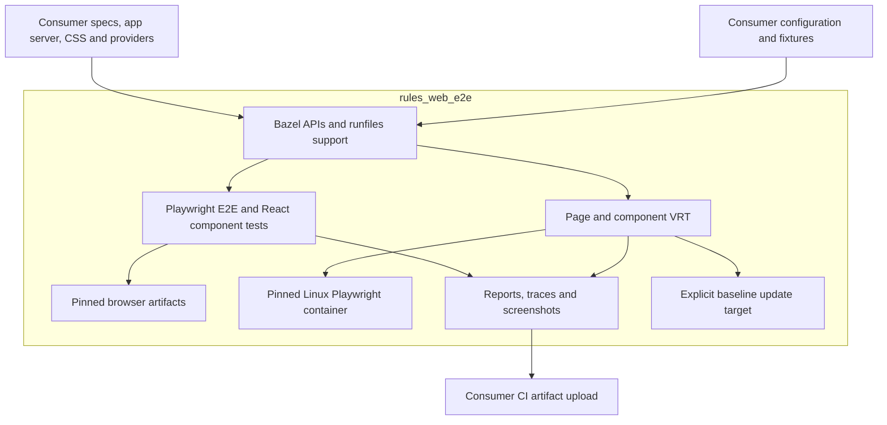

# Plan: OSS browser testing with rules_web_e2e

Build reusable Bazel rules for Playwright, web end-to-end tests, React component
browser tests, and visual regression tests (VRT). Publish through the Bazel
Central Registry (BCR), with standalone examples and documented compatibility.
`component_visual_test` is implemented; the other APIs below remain proposed.
See [architecture](architecture.md) and [visual testing design](visual-testing-design.md)
for the design boundaries. See the [component VRT guide](component-vrt.md) for the current supported setup.

## Proposed APIs

| API                       | Purpose                                                                                                    |
| ------------------------- | ---------------------------------------------------------------------------------------------------------- |
| `playwright_test`         | Run consumer-provided Playwright specs and configuration with declared dependencies and browser artifacts. |
| `web_e2e_test`            | Test a managed local server or an explicitly configured deployed URL.                                      |
| `component_browser_test`  | Mount React components and test interactions with Playwright component testing.                            |
| `component_visual_module` | Declare reusable visual cases, rendering hooks, and viewport settings.                                     |
| `component_visual_test`   | Compare component screenshots using Vitest browser mode and Playwright.                                    |
| `web_visual_test`         | Compare page screenshots using Playwright.                                                                 |

## Architecture

- **Dependencies:** build on `rules_js`, `rules_ts`, and `rules_playwright`.
  Accept explicit npm runner and dependency labels; support external repository
  mappings. Keep Starlark rules separate from executable runtime helpers.
- **Configuration:** consumers supply app servers, URLs, fixtures, authentication,
  Vite configuration, CSS, and React providers. Reporters and CI integrations
  remain configurable. Deployed tests require explicit network access.
- **Execution:** manage local server readiness, ports, and cleanup. Declare test
  inputs and isolate temporary files. Retain reports, traces, and screenshots as
  Bazel test outputs. Document supported Node, Playwright, React component-testing,
  Vitest, and browser versions, including ESM/CJS support.
- **Visual stability:** use a public, digest-pinned Linux browser image with
  matching fonts and browser version. Configure viewports, rendering hooks, and
  diff tolerances. Make Docker connection and lifecycle explicit; verify
  concurrency and cleanup before offering shared-container reuse.
- **Baselines:** store screenshots in the consumer repository. Compare tests
  never modify them; explicit `.update` targets generate and synchronize changes.
  Produce expected, actual, and diff images on failure. Ensure capture actions
  cannot reuse stale results and document platform/architecture limitations.

## Delivery and acceptance checks

1. **Foundation and web E2E:** add a standalone consumer that starts a tiny app,
   drives Chromium, and retains failure artifacts. Verify external labels,
   ESM/CJS, server readiness/cleanup, and concurrent targets on Bazel 8/9,
   Linux and macOS. Exercise deployed-URL mode against a local fixture service.
2. **Component browser:** add a React mount/interaction example with
   consumer-owned providers and CSS. Verify assets, imports, and typechecking
   using only public dependencies.
3. **VRT:** add component and page examples. Unchanged baselines must pass;
   intentional changes must fail with useful diffs; explicit updates must make
   the comparison pass again. Verify repeated captures and Docker execution on
   supported hosts. Qualify each architecture separately for screenshot stability.
4. **Release:** publish a compatibility matrix and setup guide. Check licensing
   and dependency availability. Validate the release archive in an independent
   BCR consumer without private packages or credentials. Run Docker VRT in
   dedicated CI; keep live-service tests outside registry presubmits.
