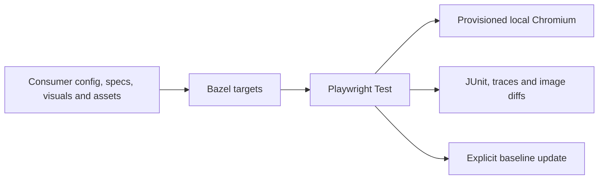

# Scope and roadmap

The supported APIs are documented in the [API reference](api.md). Current
capabilities include managed and remote E2E, native component mounts, shared
visual modules, generated VRT captures, and explicit baseline updates.

The runtime uses Playwright Test, with Bazel integration
through `rules_js` and strict TypeScript compilation through `rules_ts`.
Applications supply their own rendering framework, servers, and fixtures.

## Possible extensions

Generic `playwright_test` and page-oriented `web_visual_test` wrappers are
not implemented. A Starlark `component_visual_module` macro is not exported;
use the TypeScript `ComponentVisualModule` interface today.

Interchangeable baselines across architectures need separate validation before support.
Any extension should preserve declared inputs, explicit network access,
reviewed baseline updates, and useful failure artifacts.
