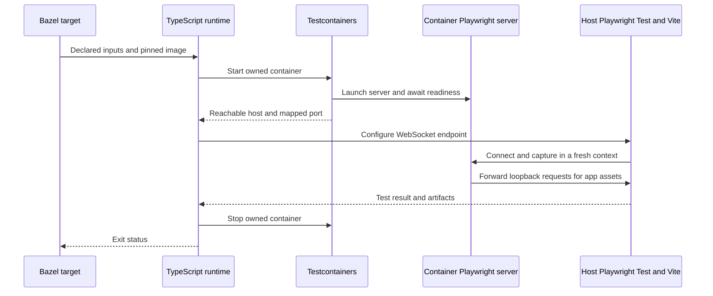

# Testcontainers and VRT stability

Run screenshot browsers in a pinned Linux environment so local and CI captures
use the same browser, system libraries, and installed fonts. Use a container
lifecycle layer to make that environment reliably available to each test.
These solve different problems: the image controls rendering inputs, while
Testcontainers manages startup, endpoint discovery, ownership, and cleanup.

**Current implementation:** the [TypeScript runner](../runtime/runner.ts) uses
the Docker CLI, with one container per invocation. Adopting the Testcontainers
library is a planned runtime change, not an existing dependency. The design
below preserves the current public Bazel and screenshot contracts.

## What makes screenshots stable

| Control               | Why it matters                                                                 | Current implementation                                                    |
| --------------------- | ------------------------------------------------------------------------------ | ------------------------------------------------------------------------- |
| Image digest          | Holds browser binaries, OS libraries, and system fonts constant.               | Public Playwright image pinned by digest.                                 |
| Client/server version | Avoids mixing a host Playwright client with a different server/browser bundle. | Validates the declared core package version and copies it into the image. |
| CPU architecture      | Different rasterization paths can still produce different pixels.              | Linux amd64 screenshots validated; no cross-architecture guarantee.       |
| Browser settings      | Viewport, locale, timezone, theme, motion, and caret affect captures.          | Fixed defaults with explicit viewport and tolerance options.              |
| Application readiness | An available server does not mean data, fonts, or UI transitions have settled. | Consumer assertions and font readiness before capture.                    |
| Fresh execution       | Stale results can hide a rendering change or skip a capture.                   | Uncached VRT invocations and fresh capture directories.                   |

Containers do not freeze clocks, network responses, animation state, or fonts
loaded by the application. Consumers still need deterministic fixtures and
explicit readiness. Increasing pixel tolerance should not compensate for an
uncontrolled rendering environment. An image upgrade requires fresh comparison
and review, not automatic replacement of every baseline.

## Proposed Testcontainers lifecycle

Keep lifecycle details behind a small typed runtime interface that returns a
WebSocket endpoint and an asynchronous cleanup operation. Consumers should not
need Testcontainers types in their Playwright config or BUILD files.

The implementation should wait for both the mapped port and Playwright server
readiness, then establish the browser connection before running cases. Use the
container runtime's reported host and mapped port rather than assuming a fixed
host port. Keep startup and test deadlines separate; retain server logs on
startup failure. Preserve loopback forwarding so source files and Vite remain
on the host without Docker bind mounts.

Use an init process to reap browser children and sufficient shared memory for
Chromium. Explicit CPU/memory limits may help avoid resource-driven timeouts,
but do not make rendering deterministic. Cleanup must cover success, assertion
failure, failed startup, and cancellation. Qualify any resource-reaper behavior
in the supported CI environment; signal handlers alone cannot clean up after
an uncatchable process termination or daemon failure.

## Isolation before reuse

Start with one owned server container per Bazel target and isolated browser
contexts for its tests. Reuse is a later performance option, disabled by default
in CI. Reusing the browser server must never mean reusing page state, storage,
fixtures, temporary outputs, or previous test results.

If reuse is added, key it on the image digest, architecture, Playwright version,
server command, and runtime settings. Coordinate concurrent creators, probe
cached endpoints, replace stale containers, and distinguish the owning process
from clients that merely connect. A client must not stop another target's
container. Keep an explicit teardown path for reusable development containers.

## Acceptance before replacing the CLI

Verify unchanged captures across fresh containers and repeated invocations,
plus intentional mismatch and missing-baseline failures. Exercise two targets
concurrently, startup timeout, browser disconnect, and cancellation; check for
leaked containers and orphan processes. Confirm matching screenshots and useful
artifacts in local and CI runs on the supported architecture. Keep compare/update
semantics unchanged as described in [visual testing design](visual-testing-design.md).
