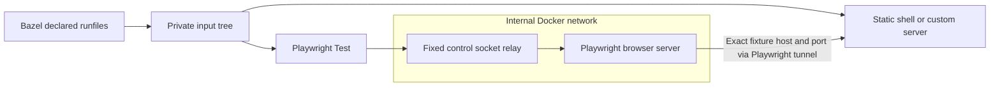

# Testcontainers and VRT stability

`visual_test` and `component_visual_test` use containers; E2E and component
browser tests launch on the host. The VRT TypeScript runtime uses Testcontainers 12.1.0 to start a fresh browser and
control relay per invocation. Both use the same digest-pinned Playwright image
and explicit `linux/amd64` platform. The runner verifies the browser's platform
and the declared Playwright package version before running tests. Ryuk, the
cleanup helper, uses a pinned image digest on the daemon-selected platform.
All images must be preloaded; execution never pulls images or authenticates to
registries. Existing Ryuk image identity is verified before reuse.

Docker cannot publish ports from an internal-only network. The relay joins that
network and a normal bridge, publishing a loopback control port. It forwards TCP
only to the browser server; it is not a general network proxy. The browser has
no external network route. Playwright's host tunnel allows only the fixture's
assigned `127.0.0.1:port` by default, so unrelated host services are not exposed.
Targets may opt into additional HTTP(S) `network_origins`; these expose the exact
host and port through the tunnel and intentionally introduce external inputs.
Wildcards, credentials, and URL paths are rejected.

The adapter owns readiness checks, endpoint discovery, startup deadlines, and
cleanup. Both containers use an init process; Chromium has 1 GiB shared memory.
It removes resources after success, test failure, or partial startup failure.
The runtime terminates host children on cancellation and timeout, escalating to
SIGKILL if needed. Ryuk handles lost client connections, including abrupt runner
termination. A broken Docker daemon can still prevent cleanup. No browser
container reuse is enabled.

## Controlling rendering inputs

| Input                               | Control                                                                                             |
| ----------------------------------- | --------------------------------------------------------------------------------------------------- |
| Browser, OS libraries, system fonts | Pinned image digest and Linux amd64 platform.                                                       |
| Built application and npm packages  | Materialized runfiles manifest; no source or output-tree mounts.                                    |
| Environment                         | Only target `env` and `env_inherit`, with fixed locale/timezone and private home/cache directories. |
| Browser requests                    | Fixture endpoint only; vendor fonts and mock API responses in declared fixtures.                    |
| Screenshot settings                 | Fixed viewport, theme, locale, timezone, reduced motion, and caret behavior.                        |
| Application readiness               | Consumer assertions and font readiness before capture.                                              |

Compare and update use the same input staging and environment policy. Update
changes snapshot mode and the final destination; it does not inherit additional
shell configuration. Image upgrades still require reviewing fresh captures.
Containers do not freeze clocks, random values, UI transitions, or application
state. Pixel tolerance should not hide uncontrolled inputs.

## Scope and verification

This is reproducible local browser testing, not a fully sandboxed Bazel action.
The host Node processes execute trusted consumer config, plugins, and tests;
those can explicitly read host files or access the network. Docker discovery,
daemon/kernel behavior, preloaded image availability, and machine resources
remain external inputs. Tests therefore remain manual, local, and uncached.
Remote Docker daemons are not supported by the loopback control binding.

Regression tests cover staging and environment isolation, fixture access,
blocked unrelated host ports, and blocked direct public-network access. The
standalone example checks committed screenshot baselines. The built-in server reads only compiled assets; dotenv loading and source
transformation are absent during execution. Consumer builds remain responsible
for their own environment and dependency discovery.

## Enforced runtime dependency contract

Beyond Bazel and standard OS facilities, Docker is the only additional installed
VRT prerequisite. Node, Playwright packages, and compiled application inputs come
from Bazel; Chromium and fonts come from the pinned browser image. Preload both
browser and Ryuk images using the [manifest](api.md#vrt-image-manifest-and-ci-preloading)
before testing. Image acquisition remains a caller-owned setup step.

CI runs `tests/preloaded-vrt.sh` in a pinned OS-only Linux container with no
installed Node, Chromium, Docker CLI, or registry credentials. It executes built
public compare/update targets using their declared runfiles and a proxy that
rejects Docker pull/auth requests. Missing-image updates must preserve baselines;
completed and failed invocations must remove their browser/relay/network resources.
The envelope uses Linux host networking so Docker's loopback relay is reachable;
it is a regression environment, not a new consumer execution requirement.

This verifies tool provisioning, not full hermeticity of consumer code. Host-side
Node code is still trusted and unsandboxed, and application clocks, randomness,
and opted-in external services remain consumer-controlled inputs.
