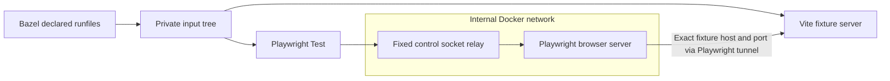

# Testcontainers and VRT stability

The TypeScript runtime uses Testcontainers 11.14.0 to start a fresh browser and
control relay per invocation. Both use the same digest-pinned Playwright image
and explicit `linux/amd64` platform. The runner verifies the browser's platform
and the declared Playwright package version before running tests. Ryuk, the
cleanup helper, also uses a pinned Linux amd64 image digest.

Docker cannot publish ports from an internal-only network. The relay joins that
network and a normal bridge, publishing a loopback control port. It forwards TCP
only to the browser server; it is not a general network proxy. The browser has
no external network route. Playwright's host tunnel allows only the fixture's
assigned `127.0.0.1:port` by default, so unrelated host services are not exposed.
Targets may opt into additional HTTP(S) `network_origins`; these expose the exact
host and port through the tunnel and intentionally introduce external inputs.
Wildcards, credentials, and URL paths are rejected.

The adapter owns readiness checks, endpoint discovery, startup deadlines, and
cleanup. Both containers use an init process; Chromium has 1 GiB shared memory.
It removes resources after success, test failure, or partial startup failure.
The runtime terminates host children on cancellation and timeout, escalating to
SIGKILL if needed. Ryuk handles lost client connections, including abrupt runner
termination. A broken Docker daemon can still prevent cleanup. No browser
container reuse is enabled.

## Controlling rendering inputs

| Input                               | Control                                                                                                                |
| ----------------------------------- | ---------------------------------------------------------------------------------------------------------------------- |
| Browser, OS libraries, system fonts | Pinned image digest and Linux amd64 platform.                                                                          |
| Application and npm packages        | Materialized runfiles manifest; no source or output-tree mounts.                                                       |
| Environment                         | Only target `env` and `env_inherit`, with fixed locale/timezone and private home/cache directories.                    |
| Vite discovery                      | Explicit config; dotenv disabled; filesystem serving restricted to staged inputs; implicit PostCSS discovery disabled. |
| Browser requests                    | Fixture endpoint only; vendor fonts and mock API responses in declared fixtures.                                       |
| Screenshot settings                 | Fixed viewport, theme, locale, timezone, reduced motion, and caret behavior.                                           |
| Application readiness               | Consumer assertions and font readiness before capture.                                                                 |

Compare and update use the same input staging and environment policy. Update
changes snapshot mode and the final destination; it does not inherit additional
shell configuration. Image upgrades still require reviewing fresh captures.
Containers do not freeze clocks, random values, UI transitions, or application
state. Pixel tolerance should not hide uncontrolled inputs.

## Scope and verification

This is reproducible local browser testing, not a fully sandboxed Bazel action.
The host Node processes execute trusted consumer config, plugins, and tests;
those can explicitly read host files or access the network. Docker discovery,
credentials, daemon/kernel behavior, image availability, and machine resources
remain external inputs. Tests therefore remain manual, local, and uncached.
Remote Docker daemons are not supported by the loopback control binding.

Regression tests cover staging and environment isolation, fixture access,
blocked unrelated host ports, and blocked direct public-network access. The
standalone example and FormatJS editor retain their existing screenshot
baselines. Compare/update probes verify that adjacent `.env.local` files and
undeclared shell variables cannot affect rendering.
