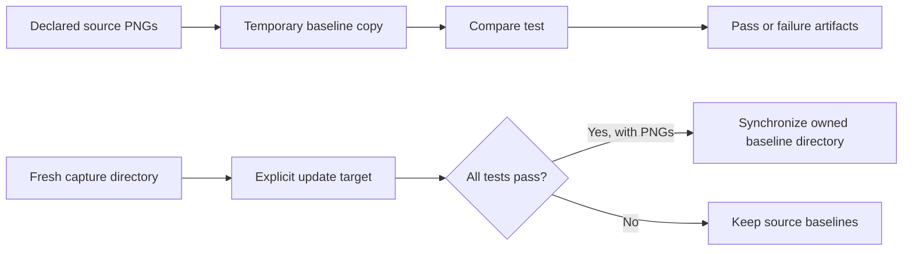

# Visual testing design

A screenshot is a reviewed assertion about a rendered state. Useful VRT must
make that state repeatable, distinguish comparison from approval, and leave
inspectable evidence when it changes.

## Stable capture

Pin the browser image by digest and match its Playwright version to the
consumer's client package. Declare the app's fonts, styles, fixtures, and other
rendering inputs. A pinned image alone cannot stabilize remote data, random
values, clocks, or asynchronous application state.

The current helper fixes viewport, locale, timezone, color scheme, and reduced
motion; it disables animations and hides the caret during capture. Consumers
wait for visible content, loaded fonts, and completed interactions before a
one-shot screenshot assertion. Reset mounted components and browser state
between cases. Screenshots of portals must include the intended overlay element.

The default allows zero mismatched pixels under the configured comparator;
this is not a promise of byte-level equality across platforms. Any relaxed
`tolerance` must be an explicit consumer choice. Validate each architecture
separately before claiming interchangeable baselines, particularly for text
rasterization and device scale. Current screenshot validation is Linux amd64.

## Baselines are consumer-owned

Comparison never writes source baselines. Missing screenshots are failures,
not permission to create a new expectation. Expected, actual, and diff images
where available, plus JUnit, go to Bazel's undeclared test outputs for CI upload.

An explicit `.update` run captures the full target into a fresh directory. Only
a successful nonempty capture synchronizes PNGs into the consumer's baseline
directory. Synchronization removes stale PNGs and preserves unrelated files;
paths cannot traverse outside the workspace or through directory symlinks.
Each target must own a separate directory. CLI filters are rejected because a
partial capture cannot safely determine which previous screenshots are stale.

Synchronization uses per-file replacement, not a transaction for the whole
directory. Do not run concurrent updates to the same directory; inspect and
review the resulting image changes before committing them.

## Execution and evidence

VRT is an explicit, `manual` test lane because it needs Docker and network
access. The `external` tag forces each test invocation to execute; `no-cache`
alone does not prevent reuse of local Bazel test results. Other execution tags
keep the current runner local and outside the filesystem sandbox. This is a
controlled rendering environment, not a fully hermetic browser action.

Keep diagnostics separate from captured baselines. Failed runs retain outputs
for inspection; successful updates may clean their temporary artifacts. A
consumer CI job uploads the test output directory and reviewers decide whether
the visual change is intended. Reporting does not depend on a hosted VRT service.

Changes to capture behavior should exercise unchanged comparison, an intentional
visual mismatch, missing baselines, and explicit update followed by comparison.
Also verify type errors stop the build, repeated captures remain stable, and
owned containers are cleaned up. The [React example](../examples/react) is the
small integration fixture; larger consumers exercise real application rendering.

## Planned reusable visual modules

This model is not implemented yet. A component visual module would describe
named states once, for both a local preview catalog and generated VRT specs.

| Concept         | Intended responsibility                                                            |
| --------------- | ---------------------------------------------------------------------------------- |
| Module identity | Stable ID and display title for a collection of related states.                    |
| Render shell    | Optional consumer-owned providers, theme, CSS, and shared assets.                  |
| Visual case     | Stable case ID, display name, and render function.                                 |
| Capture hooks   | Await readiness/interactions and select an element, including portals.             |
| VRT options     | Opt out, set a screenshot name, or declare viewport, language, theme, and density. |

Keep display names independent of screenshot identity. Reject duplicate output
names before capture, and require explicitly configured device scales. Reset
language, theme, and other per-case state rather than allowing it to leak into
later cases. Preview-only cases should remain available in the catalog without
creating baseline expectations.

A Bazel provider would carry typed module entrypoints and dependencies. Build
preview manifests and test specs from the same declarations; each consumer
app selects its own modules rather than depending on a repository-wide catalog.
Generated sources stay in Bazel outputs. These additions should preserve direct
browser tests and the current baseline ownership contract.

See the [delivery plan](oss-browser-testing-plan.md) for the remaining APIs and
acceptance checks, and the [component guide](component-vrt.md) for today's setup.
