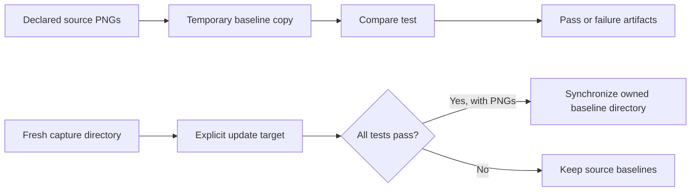
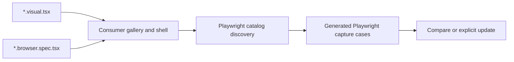

# Visual testing design

A screenshot is a reviewed assertion about a rendered state. Useful VRT must
make that state repeatable, distinguish comparison from approval, and leave
inspectable evidence when it changes.

See [Testcontainers and VRT stability](testcontainers-vrt.md) for container
lifecycle, readiness, isolation, and reuse decisions.

## Stable capture

Pin the browser image by digest and match its Playwright version to the
consumer's client package. Declare the app's fonts, styles, fixtures, and other
rendering inputs. A pinned image alone cannot stabilize remote data, random
values, clocks, or asynchronous application state.

The current helper fixes viewport, locale, timezone, color scheme, and reduced
motion; it disables animations and hides the caret during capture. Consumers
wait for visible content, loaded fonts, and completed interactions before a
Playwright screenshot assertion. Reset mounted components and browser state
between cases. Screenshots of portals must include the intended overlay element.

The default allows zero mismatched pixels under the configured comparator;
this is not a promise of byte-level equality across platforms. Any relaxed
`tolerance` must be an explicit consumer choice. Validate each architecture
separately before claiming interchangeable baselines, particularly for text
rasterization and device scale. Current screenshot validation is Linux amd64.

## Baselines are consumer-owned



Comparison never writes source baselines. Missing screenshots are failures,
not permission to create a new expectation. Expected, actual, and diff images
where available, plus JUnit, go to Bazel's undeclared test outputs for CI upload.

An explicit `.update` run captures the full target into a fresh directory. Only
a successful nonempty capture synchronizes PNGs into the consumer's baseline
directory. Synchronization removes stale PNGs and preserves unrelated files;
paths cannot traverse outside the workspace or through directory symlinks.
Each target must own a separate directory. CLI filters are rejected because a
partial capture cannot safely determine which previous screenshots are stale.

Synchronization uses per-file replacement, not a transaction for the whole
directory. Do not run concurrent updates to the same directory; inspect and
review the resulting image changes before committing them.

## Execution and evidence

VRT is an explicit, `manual` test lane because it needs Docker and network
access. The `external` tag forces each test invocation to execute; `no-cache`
alone does not prevent reuse of local Bazel test results. Other execution tags
keep the current runner local and outside the filesystem sandbox. This is a
controlled rendering environment, not a fully hermetic browser action.

Keep diagnostics separate from captured baselines. Failed runs retain outputs
for inspection; successful updates may clean their temporary artifacts. A
consumer CI job uploads the test output directory and reviewers decide whether
the visual change is intended. Reporting does not depend on a hosted VRT service.

Changes to capture behavior should exercise unchanged comparison, an intentional
visual mismatch, missing baselines, and explicit update followed by comparison.
Also verify type errors stop the build, repeated captures remain stable, and
owned containers are cleaned up. The [React example](../examples/react) is the
small integration fixture; larger consumers exercise real application rendering.

## Reusable visual modules

A `*.visual.tsx` module declares component states for previews, browser tests,
and generated VRT. A `*.browser.spec.tsx` file contains interaction assertions.
There are no consumer-authored screenshot specs.

```tsx
import type {ComponentVisualModule} from '@rules-web-e2e/vrt/visual'
import type {ReactNode} from 'react'

const visuals: ComponentVisualModule<ReactNode> = {
  id: 'components/Button',
  title: 'Button',
  renderShell: children => <AppProviders>{children}</AppProviders>,
  visuals: [
    {
      visualId: 'primary',
      name: 'Primary',
      render: () => <Button>Save</Button>,
      vrt: {viewport: {width: 400, height: 200}},
    },
  ],
}
export default visuals
```

| Field                   | Responsibility                                                              |
| ----------------------- | --------------------------------------------------------------------------- |
| `id`, `title`           | Stable module identity and display name                                     |
| `visualId`, `name`      | Stable case identity and display name                                       |
| `render`, `renderShell` | Consumer-owned component and providers                                      |
| `beforeCapture`         | Browser-side setup/readiness before capture                                 |
| `getScreenshotElement`  | Capture an element, including portals; defaults to `#root`                  |
| `vrt: false`            | Keep a preview/browser case out of screenshots                              |
| `vrt` options           | Screenshot name, viewport, integer device scale, language, light/dark theme |

VRT is enabled by default. Names default to the kebab-cased module filename plus
visual ID, with `.png`; explicit names retain existing baselines. Duplicate IDs,
duplicate filenames, and unsafe paths fail. The gallery accepts `mount('module/id',
props)` for native component browser tests; optional serializable props are
passed to `render`. Rendering stays in the browser, and the framework-free runtime
has no React dependency.



Register modules with `installVisualGallery(modules, {render, unmount})`. The
consumer renderer must await a committed render, preserve its root for updates,
and surface render errors. Imports and generated assets must be declared Bazel
inputs. See the React example's gallery.

The runner creates its capture spec only inside staged temporary inputs. It runs
a discovery pass through the consumer Playwright config, validates the catalog,
then runs one test per enabled visual with native context isolation. Per-case
viewport, density, and theme use Playwright test options; language and capture
hooks run inside the page. Global setup/teardown therefore runs for both phases
and must tolerate repeated invocation. An empty catalog fails, including updates.

Comparison and `.update` use the same generated cases and existing baseline
synchronization contract. Discovery failure prevents capture and baseline updates.
