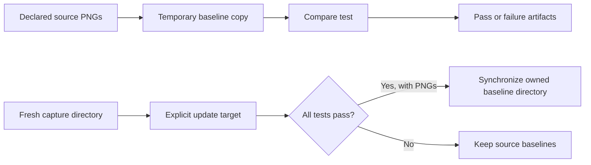
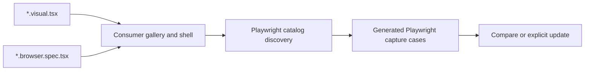

# Visual testing design

Screenshot reviewed assertion about rendered state. Useful VRT must
make that state repeatable, distinguish comparison from approval, and leave
inspectable evidence when it changes.

See [VRT on actiond](actiond.md) for execution
lifecycle, readiness, isolation, and reuse decisions.

## Stable capture

Pin browser image by digest and match its Playwright version to
consumer's client package. Declare app's fonts, styles, fixtures, and other
rendering inputs. Pinned image alone cannot stabilize remote data, random
values, clocks, or asynchronous application state.

Current helper fixes viewport, locale, timezone, color scheme, and reduced
motion; it disables animations and hides caret during capture. Consumers
wait for visible content, loaded fonts, and completed interactions before
Playwright screenshot assertion. Reset mounted components and browser state
between cases. Screenshots of portals must include intended overlay element.

Default allows zero mismatched pixels under configured comparator;
this not promise of byte-level equality across platforms. Any relaxed
`tolerance` must be explicit consumer choice. Validate each architecture
separately before claiming interchangeable baselines, particularly for text
rasterization and device scale. Current screenshot validation Linux amd64.

## Baselines are consumer-owned


```mermaid
flowchart LR
  Sources[Declared source PNGs] --> Copy[Temporary baseline copy]
  Copy --> Compare[Compare test]
  Compare --> Result[Pass or failure artifacts]
  Fresh[Fresh capture directory] --> Capture[Explicit update target]
  Capture --> Success{All tests pass?}
  Success -->|Yes, with PNGs| Sync[Synchronize owned baseline directory]
  Success -->|No| Keep[Keep source baselines]
```

Comparison never writes source baselines. Missing screenshots failures,
not permission to create new expectation. Expected, actual, and diff images
where available, plus JUnit, go to Bazel's undeclared test outputs for CI upload.

Explicit `.update` run captures full target into fresh directory. Only
successful nonempty capture synchronizes PNGs into consumer's baseline
directory. Synchronization removes stale PNGs and preserves unrelated files;
paths cannot traverse outside workspace or through directory symlinks.
Each target must own separate directory. CLI filters rejected because
partial capture cannot safely determine which previous screenshots stale.

Synchronization uses per-file replacement, not transaction for whole
directory. Do not run concurrent updates to same directory; inspect and
review resulting image changes before committing them.

## Execution and evidence

VRT explicit, `manual` lane of cacheable Linux execution actions. Runtime
files, code, fixture data, and baselines declared inputs. Local wrapper
reports downloaded results and applies successful captures on explicit updates.

Keep diagnostics separate from captured baselines. Failed runs retain outputs
for inspection; successful updates may clean their temporary artifacts.
consumer CI job uploads test output directory and reviewers decide whether
visual change intended. Reporting does not depend on hosted VRT service.

Changes to capture behavior should exercise unchanged comparison, intentional
visual mismatch, missing baselines, and explicit update followed by comparison.
Also verify type errors stop build, repeated captures remain stable, and
timed-out and cancelled actions release their processes. [React example](../examples/react)
small integration fixture; larger consumers exercise real application rendering.

## Reusable visual modules

`*.visual.tsx` module declares component states for previews, browser tests,
and generated VRT. `*.browser.spec.tsx` file contains interaction assertions.
No consumer-authored screenshot specs.

```tsx
import type {ComponentVisualModule} from '@rules-web-e2e/vrt/visual'
import type {ReactNode} from 'react'

const visuals: ComponentVisualModule<ReactNode> = {
  id: 'components/Button',
  title: 'Button',
  renderShell: children => <AppProviders>{children}</AppProviders>,
  visuals: [
    {
      visualId: 'primary',
      name: 'Primary',
      render: () => <Button>Save</Button>,
      vrt: {viewport: {width: 400, height: 200}},
    },
  ],
}
export default visuals
```

| Field | Responsibility |
| ----------------------- | --------------------------------------------------------------------------- |
| `id`, `title` | Stable module identity and display name |
| `visualId`, `name` | Stable case identity and display name |
| `render`, `renderShell` | Consumer-owned component and providers |
| `beforeCapture` | Browser-side setup/readiness before capture |
| `getScreenshotElement` | Capture element, including portals; defaults to `#root` |
| `vrt: false` | Keep preview/browser case out of screenshots |
| `vrt` options | Screenshot name, viewport, integer device scale, language, light/dark theme, CSS hover target |

VRT enabled by default. Names default to kebab-cased final segment of `module.id` plus
`visualId`, with `.png`; explicit names retain existing baselines. Duplicate IDs,
duplicate filenames, and unsafe paths fail. Gallery accepts `mount('module/id',
props)` for native component browser tests; optional serializable props
passed to `render`. Rendering stays in browser, and framework-free runtime
has no React dependency.


```mermaid
flowchart LR
  Modules["*.visual.tsx"] --> Gallery[Consumer gallery and shell]
  Gallery --> Discover[Playwright catalog discovery]
  Discover --> Cases[Generated Playwright capture cases]
  Cases --> PNG[Compare or explicit update]
  Specs["*.browser.spec.tsx"] --> Gallery
```

Register modules with `installVisualGallery(modules, {render, unmount})`.
consumer renderer must await committed render, preserve its root for updates,
and surface render errors. Imports and generated assets must be declared Bazel
inputs. See React example's gallery.

Runner creates its capture spec only inside staged temporary inputs. It runs
discovery pass through consumer Playwright config, validates catalog,
then runs one test per enabled visual with native context isolation. Per-case
viewport, density, and theme use Playwright test options; language and capture
hooks run inside page. Global setup/teardown therefore runs for both phases
and must tolerate repeated invocation. Empty catalog fails, including updates.

Comparison and `.update` use same generated cases and existing baseline
synchronization contract. Discovery failure prevents capture and baseline updates.
